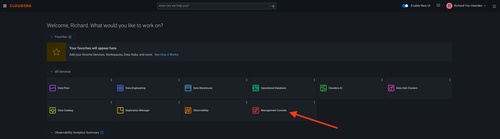
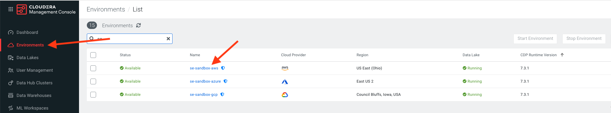
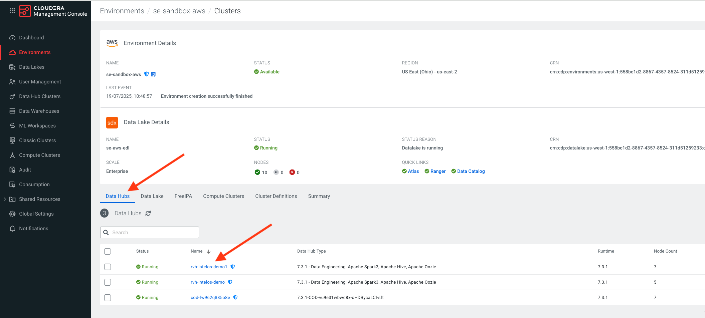
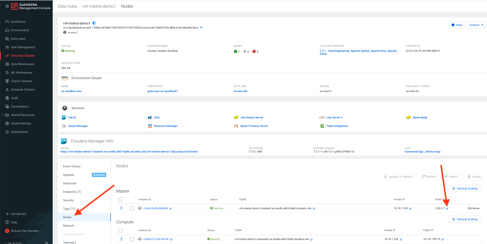
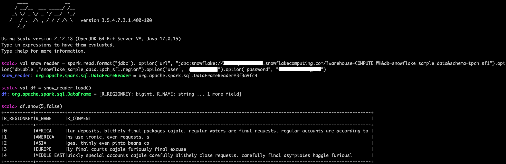
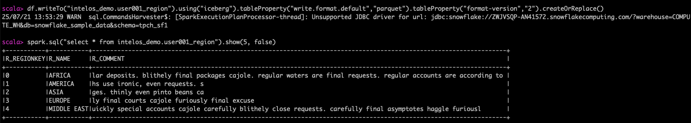

# Spark Application Development in Cloudera Data Engineering Data Hub

## Lab 1. Importing a Snowflake table to a Cloudera Data Lakehouse Iceberg table using Spark 

In Cloudera's Control Plane select the Management Console.



Select Enviornments from the menu and select your training enviornment. 



Under the enviornment navigate to the Data Hubs tab and select the HOL Data Hub.



In the Data Hub, choose Nodes froim the left hand menu and click the button to copy the public IP address of the master node.



SSH onto the master node of our Cloudera Data Engineering data Hub. Substitute the user for your userxxx number and provide the password when prompted.
```
ssh <userxxx>@<ip_adress>
```

On the master node let's open a spark-shell and reference the Snowflake JDBC driver

```
spark3-shell --jars /opt/cloudera/parcels/CDH/jars/snowflake-jdbc-3.9.2.jar --driver-class-path /opt/cloudera/parcels/CDH/jars/snowflake-jdbc-3.9.2.jar
```

At the Scala prompt set up Spark read to point to the Swowflake table we want to ingest. Your HOL facilitator will provide the <account-name>, <username> and <password> for you to substitute in the code below.

```
val snow_reader = spark.read.format("jdbc").option("url", "jdbc:snowflake://<account-name>.snowflakecomputing.com/?warehouse=COMPUTE_WH&db=snowflake_sample_data&schema=tpch_sf1").option("dbtable","snowflake_sample_data.tpch_sf1.region").option("user", "<username>").option("password", "<password>")
```

Next, execute the Spark read using the load command below
```
val df = snow_reader.load()
```

Display the dataframe data
```
df.show(5,false)
```

You should see the Snowflake table data displayed in your dataframe in Spark



Once we have the Snowflake data in the Spark dataframe we can write this data to an Iceberg V2 table in the Cloudera Data Lakehouse.

To create a new Iceberg table use the Spark Dataframe writeTo method. Specify the new table name subsititing user username userrxxx. Note the storage format we're using is Parquet and the Iceberg table version is version 2.
```
df.writeTo("intelos_demo.<userxxx>_region").using("iceberg").tableProperty("write.format.default","parquet").tableProperty("format-version","2").createOrReplace()
```
Finally let's show the Snowflake copiued data in our CDP Iceberg table
```
spark.sql("select * from intelos_demo.<userxxx>_region").show(5, false)
```


### Well done. You've just imported your first Snowflake table into a Cloudera Data Lakehouse Iceberg table
