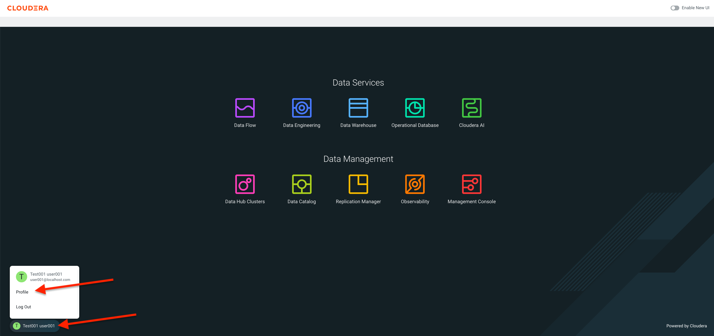
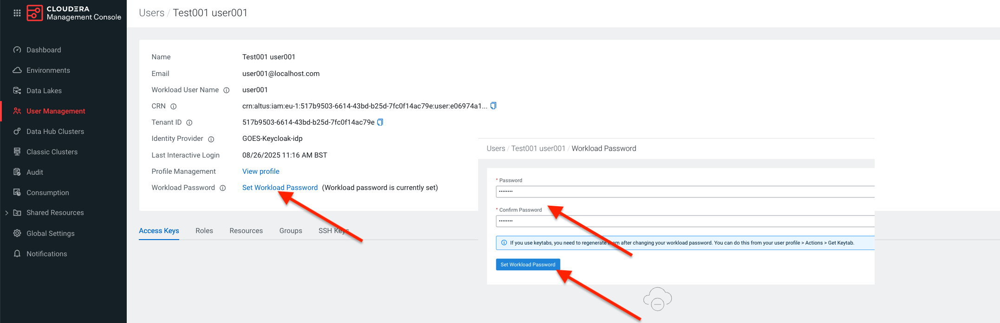
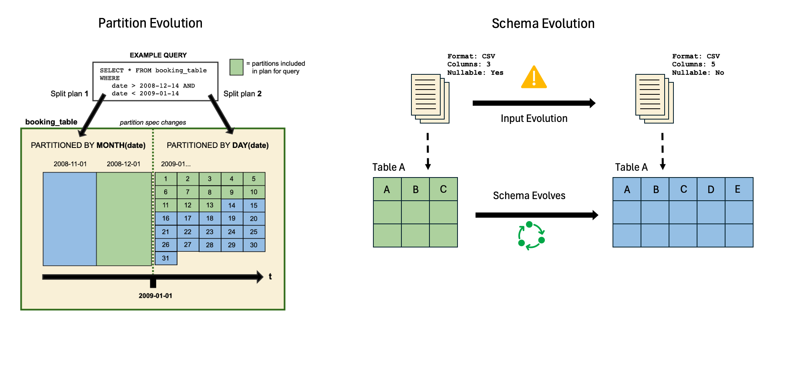
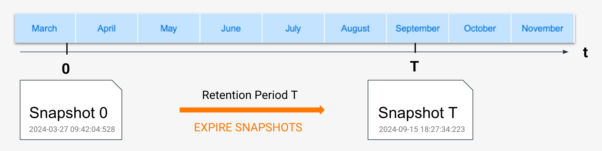
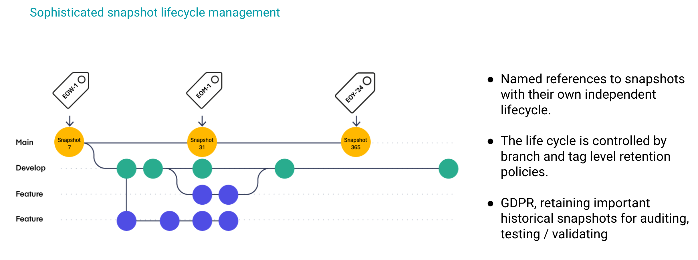
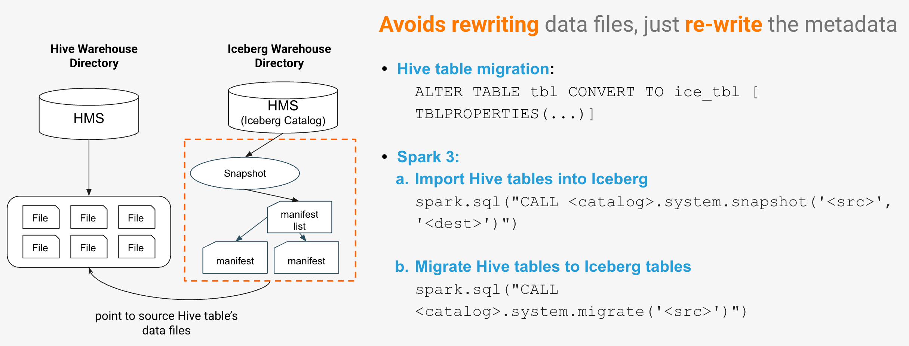

# Section 1: Spark and Iceberg on Cloudera Data Engineering Data Hubs


Cloudera Data Hub is a cloud service for creating and managing secure, isolated, and elastic workload clusters on AWS, Azure, and GCP. It uses Cloudera Runtime and is managed from the Cloudera Management Console.

The service provides pre-configured templates for common workloads but also allows for extensive customization through reusable resources like cluster definitions, templates, and scripts. This enables agile, on-demand cluster creation and automation via a web interface or CLI, with all clusters linked to a central Data Lake for security and governance.

### Agenda

* [Before Starting the Labs](#before-starting-the-labs)<br/>
* [Lab 1. Creating Iceberg Tables](#lab-1-creating-iceberg-tables)<br/>
  * [Creating an Iceberg Table](#creating-an-iceberg-table)<br/>
  * [Explore the Table Storage Location](#explore-the-table-storage-location)<br/>
  * [Understanding the Metadata Files](#understanding-the-metadata-files)<br/>
* [Lab 2. Iceberg data Manipulation](#lab-2-iceberg-data-manipulation)<br/>
  * [Best Practices for Managing Data](#best-practices-for-managing-data)<br/>
  * [Iceberg Data Inserts and Updates](#iceberg-data-inserts-and-updates)<br/>
  * [Iceberg Data Deletion](#iceberg-data-deletion)<br/>
* [Lab 3: Iceberg Tables Types (COW and MOR)](#lab-3-iceberg-tables-types-cow-and-mor)<br/>
  * [Iceberg Copy-on-Write (COW) Table](#iceberg-copy-on-write-cow-table)<br/>
  * [Iceberg Merge-on-Read (MOR) Table](#iceberg-merge-on-read-mor-table)<br/>
* [Lab 4: Schema and Partition Evolution](#lab-4-schema-and-partition-evolution)<br/>
  * [Iceberg Schema Evolution](#iceberg-schema-evolution)<br/>
  * [Iceberg Partition Evolution](#iceberg-partition-evolution)<br/>
* [Lab 5: Iceberg Time Travel & Rollbacks using Snapshots](#lab-5-iceberg-time-travel--rollbacks-using-snapshots)<br/>
  * [Understanding Time Travel in Iceberg](#understanding-time-travel-in-iceberg)<br/>
  * [Rollback Tables Using Snapshots](#rollback-tables-using-snapshots)<br/>
* [Lab 6: Iceberg Tagging, Branching and Merging](#lab-6-iceberg-tagging-branching-and-merging)<br/>
  * [Iceberg Tagging](#iceberg-tagging)<br/>
  * [Creating Branches in Iceberg](#creating-branches-in-iceberg)<br/>
  * [Merging Iceberg Branches](#merging-iceberg-branches)<br/>
* [Lab 7: Migrating tables from Hive to Iceberg](#lab-7-migrating-tables-from-hive-to-iceberg)<br/>
  * [“CONVERT” In-Place Migration Vanilla Parquet to Iceberg](#convert-in-place-migration-vanilla-parquet-to-iceberg)<br/>
  * [“Create Table As” (CATS) Migration from Vanilla Parquet to Iceberg](#create-table-as-cats-migration-from-vanilla-parquet-to-iceberg)<br/>
* [Lab 8: Iceberg Table Maintenance](#lab-8-iceberg-table-maintenance)<br/>
  * [Iceberg Compaction](#iceberg-compaction)<br/>
  * [Iceberg Expiring Snapshots](#iceberg-expiring-snapshots)<br/>

## Before Starting the Labs

**Your instructor will run through each of the exercises giving you the oppotunity to view them go through it first. After that you'll be given time to go through each exercise on your own.**

Make sure you set a workload password for your assigned workload user i.e. user001.
Log into the **Cloudera Data Platform** -> -> Click your **Profile** Name at the bottom left of the Home Page and select **Profile**.



In your user's setting page, click **Set Workload Password**, enter any password twice and click the **Set Workload Password** button.



Typically we would SSH onto the node and execute Spark commands via the command line, but for the purposes of this lab we will use JupyterLab notebooks installed on the Data Hub cluster Gateway node for a better lab experience.

> [!TIP] 
> If you prefer using the command line, you can SSH onto the public IP of a Data Hub node (using workload user name and password provided by the facilitator), follow the Labs and run the same code in a pyspark shell.

Click on the following link to open JupyterLab on the Gateway node and log on using your workload user name and password provided by the facilitator i.e user001/hsgdguquuqyququ:

```ruby
https://workshop-de-v2-gateway0.nemea-ho.sm02r9.b0.cloudera.site:9443/
```

1. In JupyterLb create a new notebook by selecting **File -> New -> Notebook**.
2. Click the **Select** button to accept the default kernel **Python3 (ipykernel)**.


3. In the first cell of the new notebook paste the code below, substituting your assigned username in the username variable <userxxx> e.g. user003. This is going to create a Spark application on the Data Hub cluster for your user.

```ruby
# Enter your assigned user below
username = "<userxxx>"

from pyspark.sql import SparkSession

spark = SparkSession.builder \
                    .appName("{}_spark_session".format(username)) \
                    .getOrCreate()

print("Code block completed")
```

4. Execute the cell code by clicking the **⏵** button or you can select cmd+enter on your keyboard to do the same.


5. Lets check that our Spark session is running in the Data Hub Resource Manager. Navigate to the **CDP Control Plane -> Management Console -> Environments -> Select your environment**.
   
7. Under your enviornment select your Data Engineering Data Hub.


7. Under your Data Hub select the **Resource Manager**


8. Go to the **Applications** tab and verify that the Spark session you created for your specific user in Jupyter is running e.g. **user001-spark-session**


If all is good then we're ready to get on with Iceberg on Spark in our Jupyter Notebook!!!

## Lab 1. Creating Iceberg Tables 

### Creating an Iceberg Table

**What is an Iceberg Table?**
An Iceberg table is an open-source table format designed for huge analytic datasets in data lakes. Think of it not as a new data storage format, but as a sophisticated management layer that sits on top of your existing data files (like Parquet, Avro, or ORC) in cloud storage like Amazon S3 or Google Cloud Storage. It brings the reliability and simplicity of traditional SQL tables to the world of big data. At its core, an Iceberg table tracks a list of data files that constitute the table's contents. Unlike older formats like Hive, which rely on tracking files at a directory level, Iceberg tracks individual files. This seemingly small difference is what unlocks a host of powerful features.

**Key benefits and limitations**
	
* **ACID Transactions**: Iceberg brings atomicity, consistency, isolation, and durability to your data lake. This means that operations are either fully completed or not at all, ensuring that your data remains in a consistent state, even with multiple users reading and writing to the same table simultaneously.
* **Schema Evolution**: With Iceberg, you can safely add, drop, rename, and even reorder columns in your table without needing to rewrite all the underlying data. This is a massive improvement over older formats where schema changes were often risky and computationally expensive.
* **Hidden Partitioning**: You can change the way your table is partitioned without breaking existing queries. Iceberg handles the partitioning logic behind the scenes, so users don't need to know the physical layout of the data to write efficient queries.
* **Time Travel and Rollback**: Every change to an Iceberg table creates a new, immutable snapshot of the table's state. This allows you to query the table as it existed at a specific point in time, which is invaluable for audits, debugging, and reproducing analyses. It also makes it easy to roll back the table to a previous version if a mistake is made.
* **Efficient Query Performance**: By storing detailed statistics about the data at the file level, Iceberg enables query engines to perform "file pruning." This means the engine can quickly identify and skip reading files that don't contain data relevant to a query, leading to significant performance gains.


1. For the remainder of this lab we'll do all of our Spark code in in your existing Jupyter notebook created above. Add a new cell to the notebook and run the code below.
   
```ruby
spark.sql("DROP TABLE IF EXISTS default.{}_managed_countries".format(username))

# Create an Iceberg table for European countries (COW by default)
spark.sql("""
    CREATE TABLE default.{}_managed_countries (
        country_code STRING,
        country_name STRING,
        population INT,
        area DOUBLE
    )
    USING iceberg
""".format(username))

# Insert data into the table
spark.sql("""
    INSERT INTO default.{}_managed_countries VALUES
    ('FR', 'France', 67391582, 643801.0),
    ('DE', 'Germany', 83149300, 357022.0),
    ('IT', 'Italy', 60262770, 301340.0)
""".format(username))

print("Code block completed")
```


2. Add a new cell to the notebook and run each code block below to query the table.
```ruby
# Query the table
df = spark.sql("SELECT * FROM default.{}_managed_countries".format(username))
df.show()

print("Code block completed")
```
3. Add a new cell to the notebook and run each code block to look at the properties of the table.
```ruby
# Describe the table
spark.sql("DESCRIBE default.{}_managed_countries".format(username)).show()

# Show the table's CREATE statement
spark.sql("SHOW CREATE TABLE default.{}_managed_countries".format(username)).show(truncate=False)

# Show the table properties
spark.sql("SHOW TBLPROPERTIES default.{}_managed_countries".format(username)).show(truncate=False)

print("Code block completed")
```
Describing the tables shows us the column names, their data types and column comments.

The create table statement give us the the current table DDL, including the storage location (note the S3 storage path, Iceberg current snapshot id, storage file type, format-version which indicates if it's an Iceberg v1 or v2 table and the different write modes  Merge-On-Read (MOR) or Copy-On-Write (COW).

> [!NOTE] 
> Iceberg v2 builds upon v1 by adding row-level updates and deletes, enabled through merge-on-read and delete files. This allows for more efficient modification of data within immutable file formats like Parquet, Avro, and ORC, without rewriting entire files. Iceberg v1 primarily focused on supporting large analytic tables with immutable file formats and snapshot-based isolation. _

### Understanding the Metadata Files


#### How These Files Work Together in Iceberg:
  * The **metastore** contains a pointer to the table's current **metadata** file.
  * A **metadata** JSON file (.metadata.json) defines the table schema and has references to snapshots.
  * A **snapshot** file (snap-*.avro) records changes and links to manifest lists.
  * A **manifest list** file (*-m0.avro) references **manifest** files that contain details of individual data files.

#### Metadata Files (*.metadata.json)
  * **Example Files**: 00000-bc161db1-05f2-4d64-baab-69ca2070db33.metadata.json  
  * **Purpose**: Stores table-level metadata such as schema, partitioning, snapshots, and file references. Each time the table structure changes (e.g., schema evolution, snapshot creation), a new metadata JSON file is generated. Older metadata files are retained to support time travel and rollback.
  * **Data Type**: JSON format (human-readable, structured key-value pairs).
  * **Why?**: JSON allows Iceberg to store metadata in a flexible, easily accessible format. New versions can be created without modifying existing files, enabling schema evolution.

#### Snapshot Files (snap-*-*.avro)
  * Example Files: snap-1185275548636187694-1-f7f549e1-bd07-44da-b170-8973c2e6e3d6.avro  
  * Purpose: Tracks table state at a specific point in time (snapshot ID, timestamp, manifest list, etc.). Allows for time travel and rollbacks to previous versions of the table.
  * Data Type: Apache Avro format (binary, optimized for structured data storage).
  * Why? Storing snapshots in Avro provides efficient serialization while keeping metadata compact and performant. Enables fast lookup of previous states for Iceberg’s time travel feature.
    
#### Manifest List Files (*-m0.avro)
  * **Example Files**: 3ecfea4f-9e06-45a9-bd7c-430fe4758283-m0.avro 
  * **Purpose**: Stores a list of manifest files associated with a snapshot. Helps Iceberg quickly determine which data files belong to which snapshot without scanning the entire table.
  * **Data Type**: Apache Avro format (binary, optimized for fast read/write).
  * **Why**?: Avro is compact and supports schema evolution, making it ideal for metadata storage. Using Avro instead of JSON for large metadata speeds up querying and file tracking.

### Explore the Table Storage Location

The SHOW CREATE TABLE command that you ran above shows the Iceberg table's definition. Lets take a look at the storage location so that we can understand how Iceberg manages metadata and data. From the SHOW CREATE TABLE response from Jupyter copy the LOCATION path. In Jupyter, open a terminal window in Jupyter and run the following code, substituting the <location_url> with the location you copied.

```ruby
hdfs dfs -ls  <storage_location>
```


From the output you can see that the Iceberg table has a **/metadata** and **/data** subfolder structure.
Now add **/metadata** onto the previous command you ran in the terminal to explore the metadata folder structure.
```ruby
hdfs dfs -ls  <storage_location>/metadata
```


The **/metadata** directory contains snapshots, schema history, and manifest files, allowing Iceberg to manage partitioning and versioning without relying on Hive Metastore, while the **/data** directory holds the actual table data files.

## Lab 2. Iceberg data Manipulation 

### Best Practices for Managing Data
  * Start with a comprehensive data model
  * Ensure that the schema is well-defined and follows consistent naming conventions.
  * Leverage nested structures for complex data

### Iceberg Data Inserts and Updates

In Iceberg, you can insert and update data using SQL commands. Inserts add new records to the table, while updates modify existing records based on a condition.

1. In your existing Jupyter notebook add a new cell and run the code below.
```ruby
# Drop the table if it exists
spark.sql("DROP TABLE IF EXISTS default.{}_english_football_teams".format(username))

# Create the table for football teams in England
spark.sql("""
    CREATE TABLE default.{}_english_football_teams (
        team_id STRING,
        team_name STRING,
        team_city STRING,
        team_stadium STRING
    )
    USING iceberg
""".format(username))

# Insert data into the table
spark.sql("""
    INSERT INTO default.{}_english_football_teams 
    VALUES 
    ('T001', 'Manchester United', 'Manchester', 'Old Trafford'),
    ('T002', 'Liverpool', 'Liverpool', 'Anfield'),
    ('T003', 'Chelsea', 'London', 'Stamford Bridge')
""".format(username))

df = spark.sql("SELECT * FROM default.{}_english_football_teams".format(username))
df.show(truncate=False)

# Update data for a football team
spark.sql("""
    UPDATE default.{}_english_football_teams
    SET team_stadium = 'New Stamford Bridge'
    WHERE team_id = 'T003'
""".format(username))

df = spark.sql("SELECT * FROM default.{}_english_football_teams".format(username))
df.show(truncate=False)

print("Code block completed")
```
2. Look at the code and output and verify the inserts and update work as you would expect.

### Iceberg Data Deletion

When performing deletions in Iceberg, it’s important to remember that Iceberg uses a snapshot mechanism. Deletions will add a new snapshot but do not immediately remove data, ensuring that deleted data can still be recovered.

#### What to Consider When Performing Deletions
  * Deletions in Iceberg are versioned and can be reverted through time travel.
  * Data is deleted based on conditions you specify (e.g., by team_id).
  * You can perform data compaction after deletion for performance optimization.

1. In your existing Jupyter notebook add a new cell and run the code below.
```ruby
# Deleting data from the table (removing Chelsea)
spark.sql("""
    DELETE FROM default.{}_english_football_teams
    WHERE team_id = 'T003'
""".format(username))

df = spark.sql("SELECT * FROM default.{}_english_football_teams".format(username))
df.show(truncate=False)

print("Code block completed")
```
2.  Look at the code and output and verify the delete works as you would expect.

## Lab 3: Iceberg Tables Types (COW and MOR) 

Iceberg tables support different storage strategies to balance performance, storage efficiency, and query speed. This section introduces the two primary approaches.

  * **Copy-on-Write (COW)**: Ensures immutability by writing new files on every update, making it ideal for ACID transactions and historical auditing.
  * **Merge-on-Read (MOR)**: Optimizes write performance by storing changes as delta files, merging them at query time—useful for real-time ingestion.
    
Each strategy has trade-offs, making them suitable for different workloads. 

 **Merge-On-Read (MOR)**
 * Writes are efficient.
 * Reads are inefficient due to read amplification, but regularly scheduled compaction can reduce inefficiency.
 * A good choice when streaming.
 * A good choice when frequently writing or updating, such as running hourly batch jobs.
 * A good choice when the percentage of data change is low.

**Copy-On-Write (COW)**
 * Reads are efficient.
 * A good choice for bulk updates and deletes, such as running a daily batch job.
 * Writes are inefficient due to write amplification, but the need for compaction is reduced.
 * A good choice when the percentage of data change is high.

### Iceberg Copy-on-Write (COW) Table

**What is a Copy-on-Write Table?**: Copy-on-Write (COW) is where instead of modifying data directly, the system creates a complete copy of the data file with the changes applied. This method makes reading data incredibly fast and efficient, as queries can simply access a clean, final version of a file without any extra processing. The downside, however, is that writing data can be slow and expensive. Even a tiny update to a single row forces the entire file to be duplicated and rewritten. This makes frequent, small changes inefficient and can lead to conflicts if multiple writes occur at the same time. While this approach is poorly suited for minor edits, it becomes ideal for large, bulk updates where changing a significant portion of the file is necessary anyway.

**Code Example:**

In your existing Jupyter notebook add a new cell and run the code below and notice how the table properties change.

```ruby
spark.sql("""
	DROP TABLE IF EXISTS default.{}_cow_countries
""".format(username))

# Create an Iceberg Copy-on-Write table for European countries
spark.sql("""
    CREATE TABLE default.{}_cow_countries (
        country_code STRING,
        country_name STRING,
        population INT,
        area DOUBLE
    )
    USING iceberg
    TBLPROPERTIES (
        'write.format.default'='orc', 
        'write.delete.mode'='copy-on-write',  -- Enable COW for delete operations
        'write.update.mode'='copy-on-write',  -- Enable COW for update operations
        'write.merge.mode'='copy-on-write'    -- Enable COW for compaction
    )
""".format(username))

# Show table properties to verify it's set for COW
spark.sql("SHOW TBLPROPERTIES default.{}_cow_countries".format(username)).show(truncate=False)

print("Code block completed")
```

### Iceberg Merge-on-Read (MOR) Table
**What is a Merge-on-Read Table?**: Merge-on-Read (MOR) is where, instead of rewriting large files for every modification, changes are simply recorded in separate, smaller files. This approach makes writing new data, like updates or deletions, significantly faster. The trade-off is that more work is required during a read operation; the system must combine the original data with the separate change files on the fly to present the most current version. In Apache Iceberg, this is handled using delete files. When you update or delete a row, the change is logged in a delete file. During a query, Iceberg uses these delete files to know which rows to ignore from the old data files and which new rows to include. Eventually, compaction merges the original data and all the changes into new, clean files, which speeds up future reads.


**Code Example:**

In your existing Jupyter notebook add a new cell and run the code below and notice how the table properties change. If you create an Iceberg v2 table in Cloudera the default is MOR.

```ruby
spark.sql("""
	DROP TABLE IF EXISTS default.{}_mor_countries
""".format(username))

# Create an Iceberg Merge-on-Read table for European countries
spark.sql("""
    CREATE TABLE default.{}_mor_countries (
        country_code STRING,
        country_name STRING,
        population INT,
        area DOUBLE
    )
    USING iceberg
    TBLPROPERTIES (
        'write.format.default'='orc', 
        'write.delete.mode'='merge-on-read',  -- Enable MOR for delete operations
        'write.update.mode'='merge-on-read',  -- Enable MOR for update operations
        'write.merge.mode'='merge-on-read'    -- Enable MOR for compaction
    )
""".format(username))

# Show table properties to verify it's set for MOR
spark.sql("SHOW TBLPROPERTIES default.{}_mor_countries".format(username)).show(truncate=False)

print("Code block completed")
```

## Lab 4: Schema and Partition Evolution



### Iceberg Schema Evolution
Schema evolution in Iceberg allows you to modify the structure of your tables over time. This includes adding, renaming, and removing columns while ensuring that historical data remains accessible without requiring a full rewrite of the table.

**Iceberg supports schema evolution operations like:**
 * Adding columns: You can add new columns without affecting the existing data or operations.
 * Renaming columns: The renaming of columns is supported without requiring data migration.
 * Changing column types: You can change the type of a column, as long as it is compatible with the existing data.
 * Dropping columns: Columns can be safely dropped if they are no longer needed.

**Why is Schema Evolution important?**
 * Adapting to business needs: As your data requirements evolve, schema changes are often necessary without disrupting production workflows.
 * Backwards compatibility: Allows for schema changes that are compatible with existing data, meaning that you can evolve the schema without breaking old queries or affecting historical data.
 * Simplifying data management: Allows incremental changes to the schema without needing full table rewrites.


**Code Example:**

In your existing Jupyter notebook add a new cell and run the code below. Examine each statement and it's output to understand how the table's schema definition is changed by adding a new column and renaming an existing one without affecting existing data or having to migrate the data.

```ruby
spark.sql("""
	DROP TABLE IF EXISTS default.{}_zoo_animals_schema_evo
""".format(username))

# Create the initial Iceberg table
spark.sql("""
    CREATE TABLE default.{}_zoo_animals_schema_evo (
        animal_id STRING,
        animal_name STRING
    )
    USING iceberg TBLPROPERTIES
""".format(username))

# Insert sample data
spark.sql("""
    INSERT INTO default.{}_zoo_animals_schema_evo VALUES 
    ('A001', 'Lion'),
    ('A002', 'Elephant'),
    ('A003', 'Giraffe')
""".format(username))

# View the Data
df = spark.sql("select * from default.{}_zoo_animals_schema_evo".format(username))
df.show(truncate=False)

# View the schema
df = spark.sql("DESCRIBE TABLE default.{}_zoo_animals_schema_evo".format(username))
df.show(truncate=False)

# Add a new column to the table
spark.sql("""
    ALTER TABLE default.{}_zoo_animals_schema_evo ADD COLUMN habitat STRING
""".format(username))

# Rename an existing column
spark.sql("""
    ALTER TABLE default.{}_zoo_animals_schema_evo RENAME COLUMN animal_name TO species_name
""".format(username))

# Insert new data into the updated schema
spark.sql("""
    INSERT INTO default.{}_zoo_animals_schema_evo VALUES 
    ('A004', 'Zebra', 'Savanna'),
    ('A005', 'Panda', 'Bamboo Forest')
""".format(username))

# View the Data
df = spark.sql("select * from default.{}_zoo_animals_schema_evo".format(username))
df.show(truncate=False)

# View the schema
df = spark.sql("DESCRIBE TABLE default.{}_zoo_animals_schema_evo".format(username))
df.show(truncate=False)

# View the create table
df = spark.sql("SHOW CREATE TABLE default.{}_zoo_animals_schema_evo".format(username))
df.show(truncate=False)

print("Code block completed")
```
### Iceberg Partition Evolution

**What is Partition Evolution?**
Partition evolution refers to the ability to modify the partitioning strategy of an Iceberg table after it has been created. This can involve changing the partitioning key (column used for partitioning) or adding new partitioning columns. Unlike traditional partitioning schemes, Iceberg allows for flexible partition evolution without needing to rewrite the entire dataset. Partitioning evolution can help optimize query performance and manage large datasets more efficiently.

**Common Partitioning Strategies**
 * Time-based partitioning: Commonly used for time-series data, partitioning by date or timestamp can help in partition pruning, making queries faster.
 * Range or hash partitioning: For datasets with discrete values like animal species, partitioning by a range of values or using hash partitioning can help balance the data across partitions.

You can change the partitioning strategy after the table has been created, even if the data already exists. This allows you to optimize partitioning as your query patterns evolve and take advantage of query optimization with regards to partition pruning as the data evolves and grows within the table.

**Code Example:**

In your existing Jupyter notebook add a new cell and run the code below. Examine each statement and it's output to understand how the table's patition strategy evolves.

```ruby
spark.sql("""
	DROP TABLE IF EXISTS default.{}_zoo_animals_partition_evo
""".format(username))

# Create the initial Iceberg table partitioned by 'animal_id'
spark.sql("""
    CREATE TABLE default.{}_zoo_animals_partition_evo (
        animal_id STRING,
        species_name STRING,
        habitat STRING
    )
    USING iceberg TBLPROPERTIES
    PARTITIONED BY (animal_id)
""".format(username))

# Insert data into the initial partitioning scheme
spark.sql("""
    INSERT INTO default.{}_zoo_animals_partition_evo VALUES
    ('A001', 'Lion', 'Savanna'),
    ('A002', 'Tiger', 'Forest')
""".format(username))

# Show the formatted schema and partitioning scheme before change
spark.sql("DESCRIBE FORMATTED default.{}_zoo_animals_partition_evo".format(username)).show(truncate=False)

# Change the partitioning scheme to partition by both 'animal_id' and 'habitat'
spark.sql("""ALTER TABLE default.{}_zoo_animals_partition_evo ADD PARTITION FIELD habitat""".format(username))

# Insert data after the partitioning scheme change
spark.sql("""
    INSERT INTO default.{}_zoo_animals_partition_evo VALUES
    ('A003', 'Elephant', 'Grassland'),
    ('A004', 'Panda', 'Mountain')
""".format(username))

# Show the formatted schema and partitioning scheme after the change
spark.sql("DESCRIBE FORMATTED default.{}_zoo_animals_partition_evo".format(username)).show(truncate=False)

# Querying data
spark.sql("""
    SELECT * FROM default.{}_zoo_animals_partition_evo
""".format(username)).show()

# QUERY THE METADATA TABLE TO LIST PARTITIONS - NOTE YOUR OLDER DATA IS NOT PARTITIONED ON "habitat"
df = spark.sql("SELECT DISTINCT partition FROM default.{}_zoo_animals_partition_evo.files".format(username))
df.show(truncate=False)

# If you want to gather more detailed partition-level information
df = spark.sql("SELECT * FROM default.{}_zoo_animals_partition_evo.files".format(username))
df.show(truncate=False)

print("Code block completed")
```

## Lab 5: Iceberg Time Travel & Rollbacks using Snapshots



### Understanding Time Travel in Iceberg

**What is Time Travel in Iceberg?**
Time travel in Iceberg allows you to query a table as it existed at a specific point in time in the past. This feature leverages Iceberg's snapshot-based architecture to track all changes made to the data over time. When you perform time travel, Iceberg will provide data based on the state of the table at a specified snapshot or timestamp.
Time travel is supported by specifying a timestamp or snapshotid when querying the table, which enables access to historical data without having to maintain separate copies of the data.

**How Time Travel enhances data management**
Historical queries: Time travel enables you to perform analysis on data as it existed at any previous time. This is valuable for auditing, debugging, and investigating historical trends.
Data recovery: In case of accidental data loss or corruption, you can use time travel to recover previous versions of data.
Simplifying rollbacks: Instead of reloading or restoring data from backups, you can simply query an earlier snapshot, reducing the complexity of data restoration.

**Key use cases and limitations**
 * Key use cases:
	* Auditing: Access historical data to verify what changes were made over time.
	* Data consistency: Ensure that queries are consistent with data at specific points in time, even in dynamic environments.
	* Bug investigation: Time travel is useful when tracking data issues or discrepancies in reports over time.
 * Limitations:
	* Snapshot retention: Older snapshots can be expired to optimize storage, which may impact time travel for long periods in the past.
	* Performance: Querying historical data may take longer depending on the size and number of snapshots involved.
	* Storage costs: Maintaining historical snapshots may increase storage costs.

**Code Example:**

In your existing Jupyter notebook add a new cell and run the code below. Examine each statement and it's output to understand how DML operations create snapshots and how we can use these snapshots to do time travel.

```ruby
spark.sql("""
	DROP TABLE IF EXISTS default.{}_european_cars_time_travel
""".format(username))

# Create an Iceberg table for European cars
spark.sql("""
    CREATE TABLE default.{}_european_cars_time_travel (
        car_id STRING,
        car_make STRING,
        car_model STRING,
        car_country STRING
    )
    USING iceberg
""".format(username))

# Insert initial data
spark.sql("""
    INSERT INTO default.{}_european_cars_time_travel VALUES 
    ('C001', 'Volkswagen', 'Golf', 'Germany'),
    ('C002', 'BMW', 'X5', 'Germany')
""".format(username))

# List the available snapshots of the table
snapshots_df = spark.sql("""
    SELECT * FROM default.{}_european_cars_time_travel.snapshots
""".format(username))
snapshots_df.show()

# Perform an update operation to modify the data 
spark.sql("""
    UPDATE default.{}_european_cars_time_travel SET car_model = 'Polo' WHERE car_id = 'C001'
""".format(username))

snapshots_df = spark.sql("""
    SELECT * FROM default.{}_european_cars_time_travel.snapshots
""".format(username))
snapshots_df.show()

# Insert new car data (Look, it's not a European Car)
spark.sql("""
    INSERT INTO default.{}_european_cars_time_travel VALUES 
    ('C003', 'FORD', 'F150', 'USA')
""".format(username))

snapshots_df = spark.sql("""
    SELECT * FROM default.{}_european_cars_time_travel.snapshots
""".format(username))
snapshots_df.show()

# We now have incorrect data in the table
df = spark.sql("SELECT * FROM default.{}_european_cars_time_travel".format(username))
df.show(truncate=False)

# Perform Time Travel to see the table before the insert
# Fetch the snapshot ID from the snapshot listing
rollback_snapshot_id_1 = snapshots_df.collect()[1].snapshot_id  
print(rollback_snapshot_id_1)

# Travel back to when the USA Cars weren't present in the table
df_time_travel = spark.sql("""
    SELECT * FROM default.{0}_european_cars_time_travel VERSION AS OF {1}
""".format(username,rollback_snapshot_id_1))
df_time_travel.show()

# Perform Time Travel to see the table before the edit
# Fetch the snapshot ID from the snapshot listing
rollback_snapshot_id_0 = snapshots_df.collect()[0].snapshot_id  
print(rollback_snapshot_id_0)

# Travel back to before we edited the table
df_time_travel = spark.sql("""
    SELECT * FROM default.{0}_european_cars_time_travel VERSION AS OF {1}
""".format(username,rollback_snapshot_id_0))
df_time_travel.show()

print("Code block completed")
```

### Rollback Tables Using Snapshots

**What is Rollback in Iceberg?**
Rollback in Iceberg allows you to revert the table's state to a specific snapshot, undoing any subsequent changes. This is useful in scenarios where data corruption, accidental deletion, or unwanted changes occur. By rolling back to a previous snapshot, you can restore the table to its desired state.

**Key Points on Rollback:**
 * Rollback to a Snapshot: You can roll back the table by specifying a snapshotid that corresponds to the point in time you wish to revert to.
 * How it works: The rollback operation rewrites the table to the state of the specified snapshot, effectively "reverting" any changes made after that snapshot.
 * Usage: Rollback can be useful in production environments where you need to ensure data integrity and recover from accidental modifications.

**Code Example:**

In your existing Jupyter notebook add a new cell and run the code below. Examine each statement and it's output to understand how DML operations create snapshots and how we can use these snapshots to do table rollbacks.

```ruby
# Drop the table if it exists
spark.sql("DROP TABLE IF EXISTS default.{}_european_cars_rollback".format(username))

# Create an Iceberg table for European cars
spark.sql("""
    CREATE TABLE default.{}_european_cars_rollback (
        car_id STRING,
        car_make STRING,
        car_model STRING,
        car_country STRING
    )
    USING iceberg
""".format(username))

# Insert initial data
spark.sql("""
    INSERT INTO default.{}_european_cars_rollback VALUES 
    ('C001', 'Volkswagen', 'Golf', 'Germany'),
    ('C002', 'BMW', 'X5', 'Germany')
""".format(username))

# Perform an update operation to modify the data 
spark.sql("""
    UPDATE default.{}_european_cars_rollback SET car_model = 'Polo' WHERE car_id = 'C001'
""".format(username))

# Insert new car data (Look, it's not a European Car)
spark.sql("""
    INSERT INTO default.{}_european_cars_rollback VALUES 
    ('C003', 'FORD', 'F150', 'USA')
""".format(username))

# Show the updated table data
df = spark.sql("SELECT * FROM default.{}_european_cars_rollback".format(username))
df.show(truncate=False)

# List the available snapshots of the table
snapshots_df = spark.sql("""
    SELECT * FROM default.{}_european_cars_rollback.snapshots
""".format(username))
snapshots_df.show()

# Rollback to the initial table state (before the USA Cars and Edits)
first_snapshot = snapshots_df.collect()[0].snapshot_id  

# Call the Roll Back Command
spark.sql("CALL spark_catalog.system.rollback_to_snapshot('default.{0}_european_cars_rollback', {1})".format(username,first_snapshot)).show()

# Show the table data after rollback
df = spark.sql("SELECT * FROM default.{}_european_cars_rollback".format(username))
df.show(truncate=False)

print("Code block completed")
```

## Lab 6: Iceberg Tagging, Branching and Merging



### Iceberg Tagging

**What Are Tags in Iceberg?**
 * Tags in Iceberg are a way to label or annotate specific versions of a table.
 * A tag can be used to mark a specific snapshot, making it easier to reference or roll back to a particular point in time.
 * Tags help manage the history and versions of the dataset, providing a mechanism for versioning without needing to create multiple tables.

**How to Use Tags for Versioning and Metadata**
 * Versioning: Tags allow you to mark versions of data with meaningful names like v1.0, snapshot_2025_01_01, or test_run.
 * Metadata Management: You can attach custom metadata to snapshots, such as the name of the person who performed a change or the reason for a particular change.
 * Tags can be helpful when needing to easily access a specific version or snapshot of data without remembering the snapshot ID.

**Code Example:**

In your existing Jupyter notebook add a new cell and run the code below. Examine each statement and it's output to understand how tags are created in Iceberg tables and can be used to query table data at a point in time using a tag name as opposed to using a snapshot id.

```ruby
# DROP THE LANDMARKS TABLE IF IT EXISTS
spark.sql("DROP TABLE IF EXISTS default.{}_belfast_landmarks".format(username))

# CREATE ICEBERG TABLE TO STORE LANDMARK DATA
spark.sql("""
    CREATE TABLE IF NOT EXISTS default.{}_belfast_landmarks (
        landmark_id STRING,
        landmark_name STRING,
        location STRING,
        description STRING
    )
    USING iceberg
""".format(username))

# INSERT SAMPLE DATA INTO THE LANDMARKS TABLE
spark.sql("""
    INSERT INTO default.{}_belfast_landmarks VALUES 
    ('L001', 'Titanic Belfast', 'Belfast', 'Interactive museum about the RMS Titanic'),
    ('L002', 'Belfast Castle', 'Belfast', '19th-century castle offering views of the city and hills')
""".format(username))

# CREATE TAG FOR THE LANDMARKS TABLE WITH RETENTION PERIOD
spark.sql("""
    ALTER TABLE default.{}_belfast_landmarks CREATE TAG 5DAY_TAG RETAIN 5 DAYS
""".format(username))

# INSERT ADDITIONAL SAMPLE DATA INTO THE LANDMARKS TABLE
spark.sql("""
    INSERT INTO default.{}_belfast_landmarks VALUES 
    ('L003', 'Queen’s University Belfast', 'Belfast', 'A prestigious university known for its research and history'),
    ('L004', 'Stormont', 'Belfast', 'Northern Ireland’s parliament buildings and grounds'),
    ('L005', 'Crumlin Road Gaol', 'Belfast', 'Historic prison turned into a museum'),
    ('L006', 'Botanic Gardens', 'Belfast', 'Public gardens featuring the Palm House and Tropical Ravine'),
    ('L007', 'Ulster Museum', 'Belfast', 'A museum housing art, history, and natural sciences exhibits'),
    ('L008', 'Titanic Dry Dock', 'Belfast', 'The historic dock where the RMS Titanic was fitted out')
""".format(username))

# QUERY AND DISPLAY THE DATA INSERTED INTO THE LANDMARKS TABLE
df = spark.sql("SELECT * FROM default.{}_belfast_landmarks".format(username))
df.show(100, False)

# QUERY AND DISPLAY REFERENCE DATA (TAGS) FOR THE LANDMARKS TABLE
spark.sql("SELECT * FROM default.{}_belfast_landmarks.refs".format(username)).show(100, False)

spark.sql("SELECT * FROM default.{}_belfast_landmarks VERSION AS OF '5DAY_TAG'".format(username)).show(100, False)

print("Code block completed")
```

### Creating Branches in Iceberg

**What is branching in Iceberg?**
Branching in Iceberg is the ability to create isolated environments to work with the data. Think of how branches work it Git repositories. These branches allow you to perform operations such as inserting, updating, or deleting data without affecting the main production data. Branching in Iceberg helps in creating versions of the data for testing, experimentation, or new features, and once the branch is ready, it can be merged back into the main branch.

**Why and when to use branches?**
 * Testing new features (e.g., testing new health metrics without affecting the existing production data).
 * Running experiments or simulations.
 * Isolating changes until they are confirmed to be stable and ready to be merged.
 * Collaborating with different teams on separate data versions before consolidating the changes.

**Code Example:**

In your existing Jupyter notebook add a new cell and run the code below. Examine each statement and it's output to understand how branches are created in Iceberg tables and how branch data can be isolated from the main table data.

```ruby
# Drop the table if it exists, so we can rerun the code
spark.sql("DROP TABLE IF EXISTS default.{}_healthcare_patient_data".format(username))

# Create an Iceberg table for healthcare patient data
spark.sql("""
    CREATE TABLE default.{}_healthcare_patient_data (
        patient_id STRING,
        patient_name STRING,
        age INT,
        diagnosis STRING,
        treatment STRING,
        doctor STRING
    )
    USING iceberg
""".format(username))

# Insert initial patient data into the base table (CREATES A SNAPSHOT)
spark.sql("""
    INSERT INTO default.{}_healthcare_patient_data VALUES 
    ('P001', 'John Doe', 45, 'Hypertension', 'Beta-blockers', 'Dr. Smith'),
    ('P002', 'Jane Roe', 50, 'Diabetes', 'Insulin', 'Dr. Johnson')
""".format(username))

# CREATE A BRANCH 
spark.sql("ALTER TABLE default.{}_healthcare_patient_data CREATE BRANCH testing_branch".format(username))

# Insert initial patient data into the base table (CREATES A SNAPSHOT)
spark.sql("""
    INSERT INTO default.{}_healthcare_patient_data.branch_testing_branch VALUES 
    ('P999', 'Richard V', 99, 'Headache', 'Time', 'Dr. Jeff')
""".format(username))

# Branch should contain the new data
spark.sql("select * from default.{}_healthcare_patient_data.branch_testing_branch".format(username)).show()

# Main table is untouched 
spark.sql("select * from default.{}_healthcare_patient_data".format(username)).show()

print("Code block completed")
```

### Merging Iceberg Branches

**What does it mean to merge branches in Iceberg?**
Merging branches in Iceberg means consolidating the changes made in a branch into the main branch. This allows updates, experiments, or testing to be brought into the mainline data once they are confirmed to be stable or necessary.

**How merging works in Iceberg**
 * You can merge changes from a branch back into the main dataset.
 * The merge operation only applies changes from the branch and doesn't affect the main branch unless there are new or modified records that need to be merged.
 * Iceberg provides methods to merge only certain changes from a branch or completely merge all data between branches.

**Code Example:**

In your existing Jupyter notebook add a new cell and run the code below. Examine each statement and it's output to understand how isolated data created branches can be merged back into the main branch of Iceberg tables.

```ruby
# Drop the table if it exists, so we can rerun the code
spark.sql("DROP TABLE IF EXISTS default.{}_healthcare_patient_data".format(username))

# Create an Iceberg table for healthcare patient data
spark.sql("""
    CREATE TABLE default.{}_healthcare_patient_data (
        patient_id STRING,
        patient_name STRING,
        age INT,
        diagnosis STRING,
        treatment STRING,
        doctor STRING
    )
    USING iceberg
""".format(username))

# Insert initial patient data into the base table (CREATES A SNAPSHOT)
spark.sql("""
    INSERT INTO default.{}_healthcare_patient_data VALUES 
    ('P001', 'John Doe', 45, 'Hypertension', 'Beta-blockers', 'Dr. Smith'),
    ('P002', 'Jane Roe', 51, 'Diabetes', 'Insulin', 'Dr. Johnson')
""".format(username))

# CREATE A BRANCH 
spark.sql("ALTER TABLE default.{}_healthcare_patient_data CREATE BRANCH testing_branch".format(username))

# Insert initial patient data into the base table (CREATES A SNAPSHOT)
spark.sql("""
    INSERT INTO default.{}_healthcare_patient_data.branch_testing_branch VALUES 
    ('P999', 'Richard V', 99, 'Headache', 'Time', 'Dr. Jeff')
""".format(username))

# Branch should contain the new data
spark.sql("select * from default.{}_healthcare_patient_data.branch_testing_branch".format(username)).show()

# Main table is untouched 
spark.sql("select * from default.{}_healthcare_patient_data".format(username)).show()

# Insert secondary patient data into the base table (CREATES A SNAPSHOT)
spark.sql("""
    INSERT INTO default.{}_healthcare_patient_data VALUES 
    ('P001', 'John Roe', 415, 'Hypertension', 'Beta-blockers', 'Dr. Smith'),
    ('P002', 'Jane Poe', 511, 'Diabetes', 'Insulin', 'Dr. Johnson')
""".format(username))

# Merge the branch back into the base table
spark.sql("""
    MERGE INTO default.{}_healthcare_patient_data AS base
    USING default.{}_healthcare_patient_data.branch_testing_branch AS branch
    ON base.patient_id = branch.patient_id
    WHEN MATCHED THEN UPDATE SET base.patient_name = branch.patient_name,
                                 base.age = branch.age,
                                 base.diagnosis = branch.diagnosis,
                                 base.treatment = branch.treatment,
                                 base.doctor = branch.doctor
    WHEN NOT MATCHED THEN INSERT (patient_id, patient_name, age, diagnosis, treatment, doctor)
    VALUES (branch.patient_id, branch.patient_name, branch.age, branch.diagnosis, branch.treatment, branch.doctor)
""".format(username,username))

# BRANCH HAS NOW BEEN MERGED INTO BASE
spark.sql("select * from default.{}_healthcare_patient_data".format(username)).show()

# Drop the branch after the merge if no longer needed
spark.sql("ALTER TABLE default.{}_healthcare_patient_data DROP BRANCH testing_branch".format(username))

print("Code block completed")
```

## Lab 7: Migrating tables from Hive to Iceberg

### “CONVERT” In-Place Migration Vanilla Parquet to Iceberg



**Background**

In-place migration from Parquet to Iceberg allows seamless conversion without moving data or creating a new table and is almost instantaneous as only the metadata is rewritten. Data files are not affected.

**Code Example:**

In your existing Jupyter notebook add a new cell and run the code below. Examine each statement and it's output to understand how a Hive table is migratred in-place to an Iceberg table.

> [!TIP] 
> Using an in-place table migration is the fastest, most efficient way to convert tables to Iceberg tables as just the metadata is rewritten, not the data files.

```ruby
# Create a regular Parquet table with sample data
spark.sql("""
    CREATE TABLE default.{}_cloudera_parquet (
        cloudera_employee STRING,
        cloudera_role STRING
    )
    USING PARQUET
""".format(username))

# Insert records into the Parquet table
spark.sql("""
    INSERT INTO default.{}_cloudera_parquet VALUES
    ('Joe Cur', 'SE'),
    ('Jane Pas', 'PS')
""".format(username))

# Display the contents of the Parquet table
spark.sql("SELECT * FROM default.{}_cloudera_parquet".format(username)).show()

# Describe the Parquet table before migration
spark.sql("DESCRIBE FORMATTED default.{}_cloudera_parquet".format(username)).show()

# Perform in-place migration from Parquet to Iceberg
spark.sql("CALL system.migrate('default.{}_cloudera_parquet')".format(username))

# Verify the migration by querying the table again
spark.sql("SELECT * FROM default.{}_cloudera_parquet".format(username)).show()

# Describe the table after migration to confirm Iceberg format
spark.sql("DESCRIBE FORMATTED default.{}_cloudera_parquet".format(username)).show()

print("Code block completed")
```

### “Create Table As” (CATS) Migration from Vanilla Parquet to Iceberg

**Background**

When migrating from Hive to Iceberg, one of the common approaches is to use the CREATE TABLE AS (CTAS) statement. This method allows you to create a new Iceberg table and populate it with data from an existing Hive table in one step, but for very large tables this can be more resource intensive and time consuming.

**Code Example:**

In your existing Jupyter notebook add a new cell and run the code below. Examine each statement and it's output to understand how isolated data created branches can be merged back into the main branch of Iceberg tables.

```ruby
# Drop existing tables if they exist
spark.sql("DROP TABLE IF EXISTS default.{}_ctas_cloudera_parquet".format(username))
spark.sql("DROP TABLE IF EXISTS default.{}_ctas_cloudera_iceberg".format(username))

# Create a Parquet table
spark.sql("""
    CREATE TABLE default.{}_ctas_cloudera_parquet (
        cloudera_employee STRING,
        cloudera_role STRING
    )
    USING PARQUET
""".format(username))

# Insert sample data into the Parquet table
spark.sql("""
    INSERT INTO default.{}_ctas_cloudera_parquet VALUES
    ('Joe Cur', 'SE'),
    ('Jane Pas', 'PS')
""".format(username))

# Display the contents of the Parquet table
spark.sql("SELECT * FROM default.{}_ctas_cloudera_parquet".format(username)).show()

# Describe the Parquet table structure
spark.sql("DESCRIBE FORMATTED default.{}_ctas_cloudera_parquet".format(username)).show()

# Create an Iceberg table from the Parquet table
spark.sql("""
    CREATE TABLE default.{}_ctas_cloudera_iceberg 
    USING iceberg 
    AS SELECT * FROM default.{}_ctas_cloudera_parquet
""".format(username,username))

# Display the contents of the Iceberg table
spark.sql("SELECT * FROM default.{}_ctas_cloudera_iceberg".format(username)).show()

# Describe the Iceberg table structure
spark.sql("DESCRIBE FORMATTED default.{}_ctas_cloudera_iceberg".format(username)).show()

print("Code block completed")
```

## Lab 8: Iceberg Table Maintenance

### Iceberg Compaction

**What is Iceberg Compaction?**

Iceberg compaction is the process of merging small data files within an Iceberg table into larger files to improve query performance and reduce metadata overhead. Iceberg writes immutable files, and over time, frequent inserts, updates, and deletes can lead to many small files that impact efficiency.

**Why is it important?**

 * Optimizes Read Performance: Reduces the number of files scanned during queries.
 * Reduces Metadata Overhead: Merging files minimizes the number of metadata entries.
 * Enhances Storage Efficiency: Helps avoid excessive small files that increase storage costs.
 * Improves Query Planning: Fewer files mean better optimization by the query engine.

**What's the Impact?**

 * Reduced Query Latency: Faster scans with fewer files.
 * Lower Metadata Management Overhead: Smaller metadata files and fewer manifest entries.
 * Potential Higher Write Costs: Compacting too frequently can increase write costs if not managed properly.

### Iceberg Expiring Snapshots

**What are Expiring Snapshots?**

Iceberg maintains a history of table snapshots, allowing for time travel and rollback. Expiring snapshots is the process of removing older snapshots that are no longer needed to free up storage and improve metadata performance.

**Why is it important?**

 * Manages Storage Growth: Prevents unnecessary accumulation of outdated snapshots.
 * Improves Query Planning: Reduces metadata size, making query planning more efficient.
 * Controls Data Retention: Helps enforce compliance policies by retaining only necessary snapshots.

**What's the Impact?**

 * Frees Up Storage Space: Reduces disk usage by removing old metadata and data files.
 * Improves Query Performance: Smaller metadata means faster query planning.
 * Irreversible Data Loss: Once expired, snapshots cannot be restored, so retention policies must be carefully set.
 * Cleans Up Old Manifest Files: Expiring snapshots removes outdated manifest files, keeping metadata management efficient.

### Code Example: Compaction and Expiring Snapshots

In your existing Jupyter notebook add a new cell and run the code below. Examine each statement and it's output to understand how small files can be compacted and how historic snapshots can be expired

```ruby
# Drop the table if it exists
spark.sql("DROP TABLE IF EXISTS default.{}_machinery_compaction".format(username))

# Create a new Iceberg table for construction machinery
spark.sql("""
    CREATE TABLE default.{}_machinery_compaction (
        machine_id STRING,
        model STRING,
        manufacturer STRING,
        weight DOUBLE,
        status STRING
    )
    USING iceberg
""".format(username))

# Insert multiple small files by writing data in multiple transactions
spark.sql("""
    INSERT INTO default.{}_machinery_compaction VALUES
    ('M001', 'Excavator X1', 'Caterpillar', 12500.5, 'Active'),
    ('M002', 'Bulldozer B2', 'Komatsu', 14500.0, 'Inactive')
""".format(username))

spark.sql("""
    INSERT INTO default.{}_machinery_compaction VALUES
    ('M003', 'Crane C3', 'Liebherr', 17500.2, 'Active'),
    ('M004', 'Dump Truck D4', 'Volvo', 22000.8, 'Active')
""".format(username))

spark.sql("""
    INSERT INTO default.{}_machinery_compaction VALUES
    ('M005', 'Concrete Mixer CM5', 'Schwing Stetter', 9500.6, 'Inactive'),
    ('M006', 'Loader L6', 'John Deere', 12800.4, 'Active')
""".format(username))

# Validate the data location after insertions
spark.sql("SHOW CREATE TABLE default.{}_machinery_compaction".format(username)).show(truncate=False)

# Rewrite data files to optimize file sizes (SIZE 1GB)
spark.sql("""
    CALL system.rewrite_data_files(table => 'default.{}_machinery_compaction', options => map('target-file-size-bytes','1073741824'))
""".format(username)).show()

# Validate the data location again after rewrite
spark.sql("SHOW CREATE TABLE default.{}_machinery_compaction".format(username)).show(truncate=False)

# Fetch the snapshot details for the table
snapshots_df = spark.sql("""
    SELECT * FROM default.{}_machinery_compaction.snapshots
""".format(username))

# Show the snapshots DataFrame
snapshots_df.show()

# Collect the snapshot IDs for the first three snapshots
rollback_snapshot_id_0 = snapshots_df.collect()[0].snapshot_id  
rollback_snapshot_id_1 = snapshots_df.collect()[1].snapshot_id  
rollback_snapshot_id_2 = snapshots_df.collect()[2].snapshot_id  

# Expire the snapshots dynamically using the collected snapshot IDs
spark.sql("""
    CALL system.expire_snapshots(table => 'default.{0}_machinery_compaction', snapshot_ids => array({1}, {2}, {3}))
""".format(username,rollback_snapshot_id_0,rollback_snapshot_id_1,rollback_snapshot_id_2)).show()

# Fetch the snapshot details for the table after expiring 
spark.sql("""
    SELECT * FROM default.{}_machinery_compaction.snapshots
""".format(username)).show()

# Verify the current state of the table
spark.sql("SELECT * FROM default.{}_machinery_compaction".format(username)).show(truncate=False)

print("Code block completed")
```
## :star: Well done - You've completed this section of the labs!
