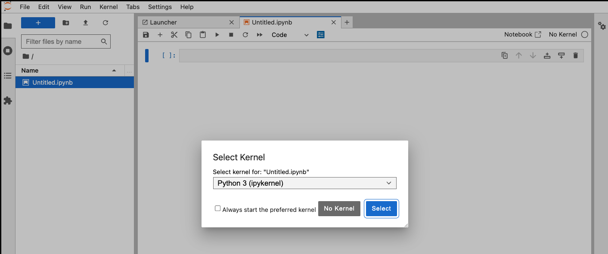
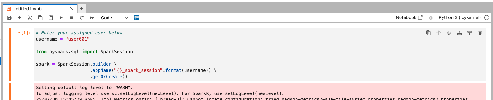
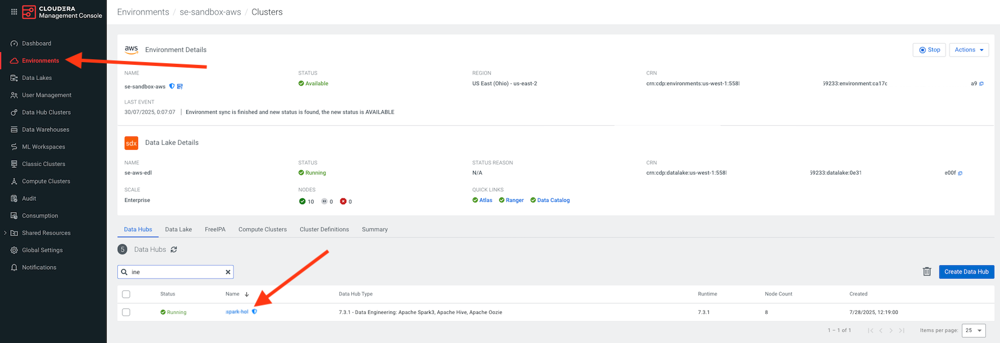
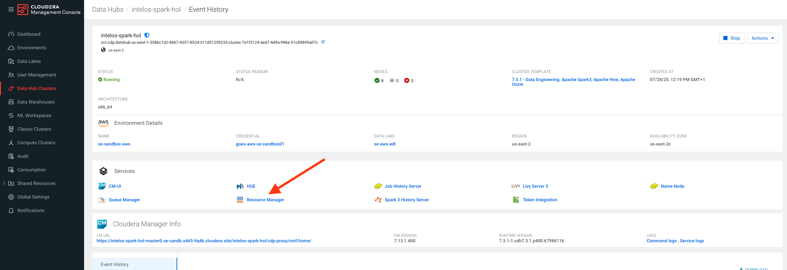
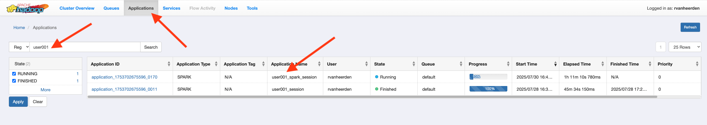
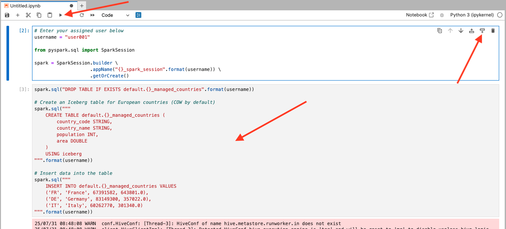
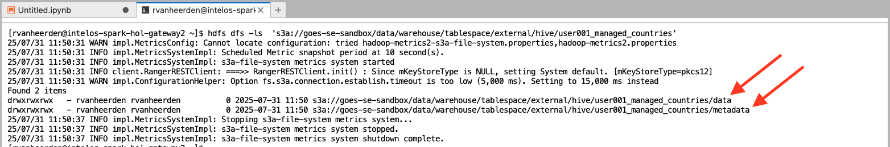
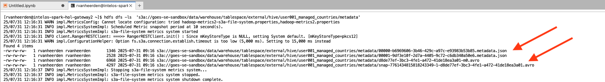
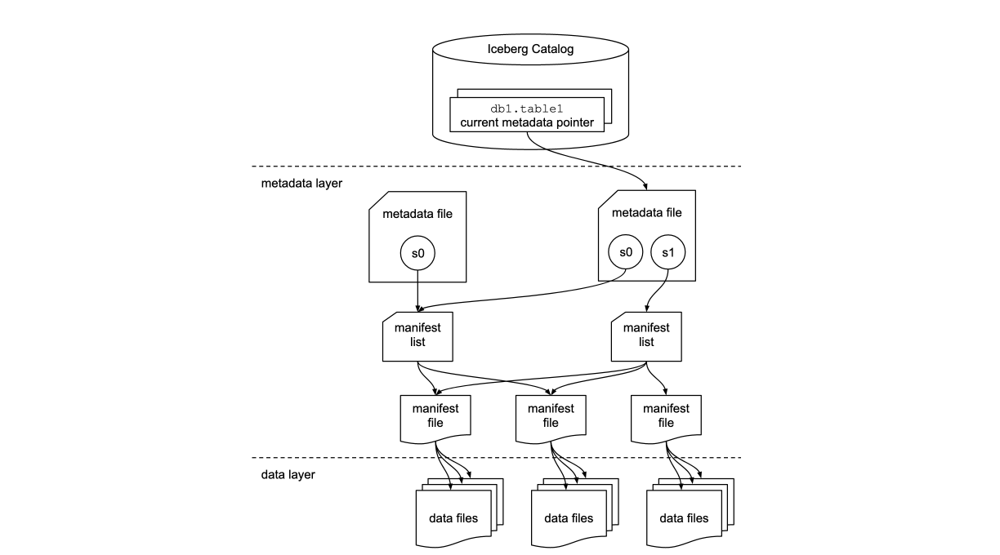

# Section 1: Spark on Cloudera Data Engineering Data Hubs

Cloudera Data Hub is a cloud service for creating and managing secure, isolated, and elastic workload clusters on AWS, Azure, and GCP. It uses Cloudera Runtime and is managed from the Cloudera Management Console.

The service provides pre-configured templates for common workloads but also allows for extensive customization through reusable resources like cluster definitions, templates, and scripts. This enables agile, on-demand cluster creation and automation via a web interface or CLI, with all clusters linked to a central Data Lake for security and governance.

Typically we would SSH onto the node and execute Spark commands via the command line, but for the purposes of this lab we will use JupyterLab notebooks installed on the Data Hub cluster Gateway node for a better lab experience.

Click on the following link to open JupyterLab on the Gateway node and log on using your workload user name and password provided by the facilitator i.e user001/hsgdguquuqyququ:

```
https://intelos-spark-hol-gateway2.se-sandb.a465-9q4k.cloudera.site:9443/
```

1. In JupyterLb create a new notebook by selecting **File -> New -> Notebook**.
2. Click the **Select** button to acceopt the default kernel **Python3 (ipykernel)**.



3. In the first cell of the new notebook paste the code below, substituting you assigned username in the username variable e.g. user003. This is going to create a Spark application on the Data Hub cluster.

```
# Enter your assigned user below
username = "<userxxx>"

from pyspark.sql import SparkSession

spark = SparkSession.builder \
                    .appName("{}_spark_session".format(username)) \
                    .getOrCreate()
```

4. Execute the cell code by clicking the **⏵** button or you can select cmd+enter on your keyboard to do the same.



5. Lets check that our Spark session is running in the Data Hub Resource Manager. Navigate to the **CDP Control Plane -> Management Console -> Environments -> Select your environment**.
   
7. Under your enviornment select your Data Engineering Data Hub.



7. Under your Data Hub select the **Resource Manager**



8. Go to the **Applications** tab and verify that the Spark session you created for your specific user in Jupyter is running e.g. **user001-spark-session**



If all is good then we're ready to get on with Iceberg on Spark in our Jupyter Notebook!!!

## Lab 1. Creating Iceberg Tables 

### Creating an Iceberg Table

**What is an Iceberg Table?**
An Iceberg Table is a table where Iceberg manages both the metadata and the data. It’s a fully integrated table that Iceberg can track and manage for you. When you drop an Iceberg Table, Iceberg removes both the metadata and the data itself.

**Use an Iceberg Table when:**
You need Iceberg to fully handle both the data and metadata.
You want to manage the entire lifecycle of the table automatically.
You need atomic operations, such as schema evolution, partition evolution, and time travel.

**Key benefits and limitations**
**Benefits:**
Simplified data management.
Automatic metadata handling.
Built-in features like time travel and schema evolution.
**Limitations:**
Dropping the table deletes all data.

**Note:** By default, when you create an Iceberg table, it will be a Copy-on-Write (COW) table. This means that when you modify data, a new version of the data is written, and old data is not overwritten. You can explicitly specify the table type as Copy-on-Write (COW) or Merge-on-Write (MOR) using table properties.

1. For the remainder of this lab we'll do all of our Spark code in in your existing Jupyter notebook created above. Add a new cell to the notebook and run the code below.
```
spark.sql("DROP TABLE IF EXISTS default.{}_managed_countries".format(username))

# Create an Iceberg table for European countries (COW by default)
spark.sql("""
    CREATE TABLE default.{}_managed_countries (
        country_code STRING,
        country_name STRING,
        population INT,
        area DOUBLE
    )
    USING iceberg TBLPROPERTIES ('format-version' = '2')
""".format(username))

# Insert data into the table
spark.sql("""
    INSERT INTO default.{}_managed_countries VALUES
    ('FR', 'France', 67391582, 643801.0),
    ('DE', 'Germany', 83149300, 357022.0),
    ('IT', 'Italy', 60262770, 301340.0)
""".format(username))
```


2.Add a new cell to the notebook and run each code block below to query the table.
```
# Query the table
df = spark.sql("SELECT * FROM default.{}_managed_countries".format(username))
df.show()
```
3.Add a new cell to the notebook and run each code block to look at the properties of the table.
```
# Describe the table
spark.sql("DESCRIBE default.{}_managed_countries".format(username)).show()

# Show the table's CREATE statement
spark.sql("SHOW CREATE TABLE default.{}_managed_countries".format(username)).show(truncate=False)

# Show the table properties
spark.sql("SHOW TBLPROPERTIES default.{}_managed_countries".format(username)).show(truncate=False)
```
Describing the tables shows us the column names, their data types and column comments.

The create table statement give us the the current table DDL, including the storage location (not the S3 storage path, Iceberg current snapshot id, storage file type, format-version which indicates if it's an Iceberg v1 or v2 table and the different write modes  Merge-On-Read (MOR - default) or Copy-On-Write (COW).

> [!NOTE] 
> Iceberg v2 builds upon v1 by adding row-level updates and deletes, enabled through merge-on-read and delete files. This allows for more efficient modification of data within immutable file formats like Parquet, Avro, and ORC, without rewriting entire files. Iceberg v1 primarily focused on supporting large analytic tables with immutable file formats and snapshot-based isolation. _

> [!NOTE] 
> There are pros and cons to choosing which Iceberg Merge-On-Read or Copy-On-Write write mode to use. This table can help you decide which strategies to use for your Iceberg table.

| **Feature** | **Copy-On-Write (COW)** | **Merge-On-Read (MOR)**
| --- | --- | --- | 
| Write Strategy | Rewrites entire affected files	| Creates separate delete/update files
| Read Performance	| Fast, as data is fully compacted	| Slower, as delete files must be applied
| Write Performance	| Slow, due to full file rewrites	| Faster, as only small delete/update files are written
| Storage Impact	| Higher, due to frequent file rewrites	| Lower, as full files are not rewritten
| Use Case Suitability	| Workloads with frequent reads and infrequent updates	| Workloads with frequent updates and fewer reads
| Update Mechanism	| Full file rewrite on update	| Newly updated rows written separately, old data marked as deleted
| Delete Mechanism	| Full file rewrite on delete	| Deletes tracked in separate delete files
| Compaction Requirement	| Not required frequently	| Required periodically to merge delete files
| Best For	| Read-heavy workloads, analytics, bulk updates	| Update-heavy workloads, streaming ingestion, incremental updates

### Explore the Tables Storage Location

The SHOW CREATE TABLE command that you ran above shows the Iceberg table's definition. Lets take a look at the storage location so that we can understand how Iceberg manages metadata and data. From the SHOW CREATE TABLE response from Jupyter copy the LOCATION path. In Jupyter, open a terminal window in Jupyter and run the following code, substituting the <location_url> with the locatioon you copied.

```
hdfs dfs -ls  <storage_location>
```


From the output you can see that the Iceberg table has a /metadata and /data subfolder structure.
Now add /metadata onto the orevious command you ran in the terminsal to explore the metadata folder structure.
```
hdfs dfs -ls  <storage_location>/metadata
```


The /metadata directory contains snapshots, schema history, and manifest files, allowing Iceberg to manage partitioning and versioning without relying on Hive Metastore, while the /data directory holds the actual table data files.

### Understanding the Metadata Files

#### Metadata Files (*.metadata.json)
  * **Example Files**: 00000-bc161db1-05f2-4d64-baab-69ca2070db33.metadata.json  
  * **Purpose**: Stores table-level metadata such as schema, partitioning, snapshots, and file references. Each time the table structure changes (e.g., schema evolution, snapshot creation), a new metadata JSON file is generated. Older metadata files are retained to support time travel and rollback.
  * **Data Type**: JSON format (human-readable, structured key-value pairs).
* **Why?**: JSON allows Iceberg to store metadata in a flexible, easily accessible format. New versions can be created without modifying existing files, enabling schema evolution.

#### Manifest List Files (*-m0.avro)
  * **Example Files**: 3ecfea4f-9e06-45a9-bd7c-430fe4758283-m0.avro 
  * **Purpose**: Stores a list of manifest files associated with a snapshot. Helps Iceberg quickly determine which data files belong to which snapshot without scanning the entire table.
  * **Data Type**: Apache Avro format (binary, optimized for fast read/write).
  * **Why**?: Avro is compact and supports schema evolution, making it ideal for metadata storage. Using Avro instead of JSON for large metadata speeds up querying and file tracking.

#### Snapshot Files (snap-*-*.avro)
  * Example Files: snap-1185275548636187694-1-f7f549e1-bd07-44da-b170-8973c2e6e3d6.avro  
  * Purpose: Tracks table state at a specific point in time (snapshot ID, timestamp, manifest list, etc.). Allows for time travel and rollbacks to previous versions of the table.
  * Data Type: Apache Avro format (binary, optimized for structured data storage).
  * Why? Storing snapshots in Avro provides efficient serialization while keeping metadata compact and performant. Enables fast lookup of previous states for Iceberg’s time travel feature.

#### How These Files Work Together in Iceberg:
  * A **metadata** JSON file (.metadata.json) defines the table schema and references snapshots.
  * A **snapshot** file (snap-*.avro) records changes and links to manifest lists.
  * A **manifest list** file (*-m0.avro) references **manifest** files that contain details of individual data files.




## Lab 2. Iceberg data Manipulation 

### Best Practices for Managing Data
  * Start with a comprehensive data model
  * Ensure that the schema is well-defined and follows consistent naming conventions.
  * Leverage nested structures for complex data
  * Consider future analytics needs when defining partitions
  * Avoid frequest schema and partition changes
  * Monitor table performance as data grows, particularly with large updates.

### Iceberg Data Inserts and Updates

In Iceberg, you can insert and update data using SQL commands. Inserts add new records to the table, while updates modify existing records based on a condition.

1. In your existing Jupyter notebook add a new cell and run the code below.
```
# Drop the table if it exists
spark.sql("DROP TABLE IF EXISTS default.{}_english_football_teams".format(username))

# Create the table for football teams in England
spark.sql("""
    CREATE TABLE default.{}_english_football_teams (
        team_id STRING,
        team_name STRING,
        team_city STRING,
        team_stadium STRING
    )
    USING iceberg
""".format(username))

# Insert data into the table
spark.sql("""
    INSERT INTO default.{}_english_football_teams 
    VALUES 
    ('T001', 'Manchester United', 'Manchester', 'Old Trafford'),
    ('T002', 'Liverpool', 'Liverpool', 'Anfield'),
    ('T003', 'Chelsea', 'London', 'Stamford Bridge')
""".format(username))

df = spark.sql("SELECT * FROM default.{}_english_football_teams".format(username))
df.show(truncate=False)

# Update data for a football team
spark.sql("""
    UPDATE default.{}_english_football_teams
    SET team_stadium = 'New Stamford Bridge'
    WHERE team_id = 'T003'
""".format(username))

df = spark.sql("SELECT * FROM default.{}_english_football_teams".format(username))
df.show(truncate=False)
```
2. Look at the code and output and verify the inserts and update work as you would expect.

### Iceberg Data Deletion

When performing deletions in Iceberg, it’s important to remember that Iceberg uses a snapshot mechanism. Deletions will add a new snapshot but do not immediately remove data, ensuring that deleted data can still be recovered.

#### What to Consider When Performing Deletions
  * Deletions in Iceberg are versioned and can be reverted through time travel.
  * Data is deleted based on conditions you specify (e.g., by team_id).
  * You can perform data compaction after deletion for performance optimization.

1. In your existing Jupyter notebook add a new cell and run the code below.
```
# Deleting data from the table (removing Chelsea)
spark.sql("""
    DELETE FROM default.{}_english_football_teams
    WHERE team_id = 'T003'
""".format(username))

df = spark.sql("SELECT * FROM default.{}_english_football_teams".format(username))
df.show(truncate=False)
```
2.  Look at the code and output and verify the delete works as you would expect.

## Lab 3: Iceberg Tables Types (COW, MOR and MOW) 

Iceberg tables support different storage strategies to balance performance, storage efficiency, and query speed. This section introduces the three primary approaches

  * **Copy-on-Write (COW)**: Ensures immutability by writing new files on every update, making it ideal for ACID transactions and historical auditing.
  * **Merge-on-Read (MOR)**: Optimizes write performance by storing changes as delta files, merging them at query time—useful for real-time ingestion.
  * **Merge-on-Write (MOW)**: Merges updates directly into existing files, reducing storage overhead and improving efficiency for frequent updates.
    
Each strategy has trade-offs, making them suitable for different workloads. The following sections provide details, comparisons, and implementation examples.

### <ins>1. Iceberg Copy-on-Write (COW) Table</ins>

**What is a Copy-on-Write Table?**: A Copy-on-Write (COW) table in Iceberg creates a new version of the data on each modification. The old data is not overwritten. Instead, a new version of the data is written to disk. This approach ensures that the data remains immutable, which makes it suitable for use cases that require strong consistency and atomicity.

**How it differs to Merge-on-Write and Merge-on-Read:**
  * Merge-on-Write: Modifications are immediately merged into the existing data files, whereas Copy-on-Write writes a new file and retains the old ones.
  * Merge-on-Read: Uses a merge operation when reading data, but doesn’t alter the underlying files, unlike Copy-on-Write, which rewrites the files with each update.
    
**Key Use Cases:**
  * Use Copy-on-Write when you need full ACID transaction support for your data.
  * It’s ideal for batch jobs where the data doesn’t change frequently.
  * Suitable for applications where old versions of the data may need to be retained for audit purposes.

**Code Example:**

In your existing Jupyter notebook add a new cell and run the code below and notice how the table properties change.

```
spark.sql("""
	DROP TABLE IF EXISTS default.{}_cow_countries
""".format(username))

# Create an Iceberg Copy-on-Write table for European countries
spark.sql("""
    CREATE TABLE default.{}_cow_countries (
        country_code STRING,
        country_name STRING,
        population INT,
        area DOUBLE
    )
    USING iceberg
    TBLPROPERTIES (
        'write.format.default'='orc', 
        'write.delete.mode'='copy-on-write',  -- Enable COW for delete operations
        'write.update.mode'='copy-on-write',  -- Enable COW for update operations
        'write.merge.mode'='copy-on-write'    -- Enable COW for compaction
    )
""".format(username))

# Show table properties to verify it's set for COW
spark.sql("SHOW TBLPROPERTIES default.{}_cow_countries".format(username)).show(truncate=False)
```

### <ins>2. Iceberg Merge-on-Read (MOR) Table</ins>
**What is a Merge-on-Read Table?**: Merge-on-Read (MOR) tables optimize write performance by storing changes as delta files instead of rewriting entire data files. These delta files are merged at query time, which reduces write latency but increases read complexity. This approach is particularly useful for real-time ingestion and event-driven applications, where updates occur frequently.

**How it Differs from Copy-on-Write and Merge-on-Write**: 
  * Copy-on-Write (COW): Writes a new file for each modification, ensuring immutability but increasing storage usage.
  * Merge-on-Write (MOW): Directly modifies existing files, making updates more efficient while still requiring periodic cleanup.
    
**Key Use Cases**:
  * Real-time ingestion of data where updates occur frequently.
  * Event-driven architectures where append operations dominate.
  * Optimized for streaming workloads, reducing write latency while maintaining historical changes.

**Code Example:**

In your existing Jupyter notebook add a new cell and run the code below and notice how the table properties change. If you create an Iceberg v2 table in Cloudera the default is MOR.

```
spark.sql("""
	DROP TABLE IF EXISTS default.{}_mor_countries
""".format(username))

# Create an Iceberg Merge-on-Read table for European countries
spark.sql("""
    CREATE TABLE default.{}_mor_countries (
        country_code STRING,
        country_name STRING,
        population INT,
        area DOUBLE
    )
    USING iceberg
    TBLPROPERTIES (
        'write.format.default'='orc', 
        'write.delete.mode'='merge-on-read',  -- Enable MOR for delete operations
        'write.update.mode'='merge-on-read',  -- Enable MOR for update operations
        'write.merge.mode'='merge-on-read'    -- Enable MOR for compaction
    )
""".format(username))

# Show table properties to verify it's set for MOR
spark.sql("SHOW TBLPROPERTIES default.{}_mor_countries".format(username)).show(truncate=False)
```

### <ins>3. Iceberg Merge-on-Write (MOW) Table</ins>
**What is a Merge-on-Write Table?**: Merge-on-Write (MOR) tables are similar to Copy-on-Write tables in that they support ACID transactions. However, in MOW tables, modifications are not written as new files. Instead, the changes are merged into existing files, reducing storage overhead. This makes it more efficient in scenarios where data updates are frequent, and keeping historical data is not necessary.

**How it differs from Copy-on-Write and Merge-on-Read**: 
  * Copy-on-Write: Writes new files for each modification, making it ideal for scenarios where immutability is important.
  * Merge-on-Write: Merges updates into existing files, which makes it more storage-efficient but may lack some immutability guarantees.
    
**Key Use Cases**:
  * Ideal when you need to store large datasets but want to avoid the overhead of rewriting full data files on every update.

**Code Example:**

In your existing Jupyter notebook add a new cell and run the code below and notice how the table properties change.

```
spark.sql("""
	DROP TABLE IF EXISTS default.{}_mow_countries
""".format(username))

# Create an Iceberg Merge-on-Write table for European countries
spark.sql("""
    CREATE TABLE default.{}_mow_countries (
        country_code STRING,
        country_name STRING,
        population INT,
        area DOUBLE
    )
    USING iceberg
    TBLPROPERTIES (
        'write.format.default'='orc', 
        'write.delete.mode'='merge-on-write',  -- Enable MOW for delete operations
        'write.update.mode'='merge-on-write',  -- Enable MOW for update operations
        'write.merge.mode'='merge-on-write'    -- Enable MOW for compaction
    )
""".format(username))

# Show table properties to verify it's set for MOW
spark.sql("SHOW TBLPROPERTIES default.{}_mow_countries".format(username)).show(truncate=False)
```


