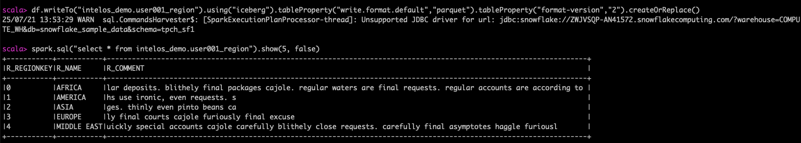

# Section 1: Spark on Cloudera Data Engineering Data Hubs

Working with Spark on Cloudera Data Engineering Data Hubs

Cloudera Data Hub is a cloud service for creating and managing secure, isolated, and elastic workload clusters on AWS, Azure, and GCP. It uses Cloudera Runtime and is managed from the Cloudera Management Console.

The service provides pre-configured templates for common workloads but also allows for extensive customization through reusable resources like cluster definitions, templates, and scripts. This enables agile, on-demand cluster creation and automation via a web interface or CLI, with all clusters linked to a central Data Lake for security and governance.

Typically we would SSH onto the node and execute Spark commands via the command line, but for the purposes of this lab we will use JupyterLab notebooks installed on the Data Hub cluster Gateway node for a better lab experience.

Click on the following link to open JupyterLab on the Gateway node and log on using your workload user name and password provided by the facilitator i.e user001/hsgdguquuqyququ:

```
https://intelos-spark-hol-gateway2.se-sandb.a465-9q4k.cloudera.site:9443/
```


## Lab 1. Creating Iceberg Tables 

### Creating an Iceberg Table

**What is an Iceberg Table?**
An Iceberg Table is a table where Iceberg manages both the metadata and the data. It’s a fully integrated table that Iceberg can track and manage for you. When you drop an Iceberg Table, Iceberg removes both the metadata and the data itself.

**Use an Iceberg Table when:**
You need Iceberg to fully handle both the data and metadata.
You want to manage the entire lifecycle of the table automatically.
You need atomic operations, such as schema evolution, partition evolution, and time travel.

**Key benefits and limitations**
**Benefits:**
Simplified data management.
Automatic metadata handling.
Built-in features like time travel and schema evolution.
**Limitations:**
Dropping the table deletes all data.

**Note:** By default, when you create an Iceberg table, it will be a Copy-on-Write (COW) table. This means that when you modify data, a new version of the data is written, and old data is not overwritten. You can explicitly specify the table type as Copy-on-Write (COW) or Merge-on-Write (MOR) using table properties.

1. In JupyterLb create a new notebook by selecting **File -> New -> Notebook**.
2. Click the **Select** button to acceopt the default kernel **Python3 (ipykernel)**.


3. In the first cell of the new notebook paste the code below, substituting you assigned username in the username variable e.g. user003. This is going to create a Spark application on the Data Hub cluster.

```
# Enter your assigned user below
username = "<userxxx>"

from pyspark.sql import SparkSession

spark = SparkSession.builder \
                    .appName("{}_spark_session".format(username)) \
                    .getOrCreate()
```

4. Execute the cell code by clicking the **⏵** button or you can select cmd+enter on your keyboard to do the same.


5. 

### Validate the HDFS Location
### Background
### Understanding the Metadata Files


Select Enviornments from the menu and select your training enviornment. 


Under the enviornment navigate to the Data Hubs tab and select the HOL Data Hub.


In the Data Hub, choose Nodes froim the left hand menu and click the button to copy the public IP address of the master node.


SSH onto the master node of our Cloudera Data Engineering data Hub. Substitute the user for your userxxx number and provide the password when prompted.
```
ssh <userxxx>@<ip_adress>
```

On the master node let's open a spark-shell and reference the Snowflake JDBC driver

```
spark3-shell --jars /opt/cloudera/parcels/CDH/jars/snowflake-jdbc-3.9.2.jar --driver-class-path /opt/cloudera/parcels/CDH/jars/snowflake-jdbc-3.9.2.jar
```

At the Scala prompt set up Spark read to point to the Swowflake table we want to ingest. Your HOL facilitator will provide the <account-name>, <username> and <password> for you to substitute in the code below.

```
val snow_reader = spark.read.format("jdbc").option("url", "jdbc:snowflake://<account-name>.snowflakecomputing.com/?warehouse=COMPUTE_WH&db=snowflake_sample_data&schema=tpch_sf1").option("dbtable","snowflake_sample_data.tpch_sf1.region").option("user", "<username>").option("password", "<password>")
```

Next, execute the Spark read using the load command below
```
val df = snow_reader.load()
```

Display the dataframe data
```
df.show(5,false)
```

You should see the Snowflake table data displayed in your dataframe in Spark


Once we have the Snowflake data in the Spark dataframe we can write this data to an Iceberg V2 table in the Cloudera Data Lakehouse.

To create a new Iceberg table use the Spark Dataframe writeTo method. Specify the new table name subsititing user username userrxxx. Note the storage format we're using is Parquet and the Iceberg table version is version 2.
```
df.writeTo("intelos_demo.<userxxx>_region").using("iceberg").tableProperty("write.format.default","parquet").tableProperty("format-version","2").createOrReplace()
```
Finally let's show the Snowflake copiued data in our CDP Iceberg table
```
spark.sql("select * from intelos_demo.<userxxx>_region").show(5, false)
```


### Well done. You've just imported your first Snowflake table into a Cloudera Data Lakehouse Iceberg table
