# Section 2: Demonstrating Iceberg Capabilities across the Data Lifecycle and Cloudera Product Stack

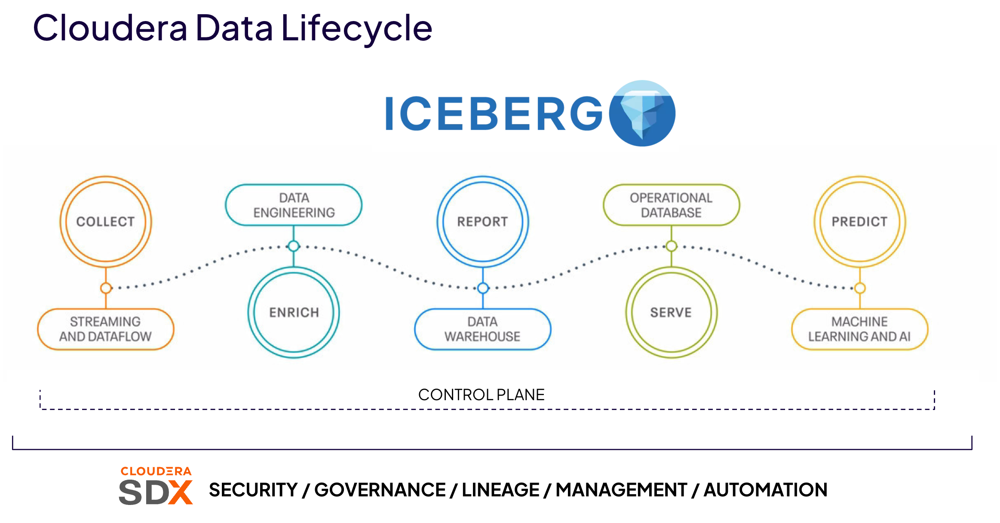

Cloudera Open Data Lakehouse powered by Apache Iceberg offers several key benefits that can significantly enhance your data management strategy. First, it provides better **performance and scalability** through innovative metadata management and flexible partitioning. It’s **fully open**, meaning there’s no vendor lock-in—thanks to its open-source foundation, it **supports a diverse ecosystem and community**. The platform also supports **multi-function analytics**, allowing different compute engines to access and process Iceberg tables concurrently and consistently. For those focused on data quality and consistency, it includes advanced capabilities like **ACID-compliant transactions, time travel, rollback, in-place partition evolution, and Iceberg replication**. Finally, Cloudera’s solution stands out with its ability to enable **multi-hybrid cloud deployments**, offering the freedom and portability to deploy wherever you need.

This Hands on lab takes you through the data lifecycle showcasing the ability to work with the same Iceberg tables across multiple engine and analytics types.

## Before Starting the Labs

Your workload user name and password has been provided by the facilitator e.g. user001/hsgdguquuqyququ. Keep it handy as you'll need it for certain configurations.

We're going to create some Iveberg tables to use across the labs in this section.

1. Sign in to the Cloudera Control Plane web interface.
2. On the **Data Warehouse** tile, click on the ellipses &#10247;and select **Open Data Warehouse**.

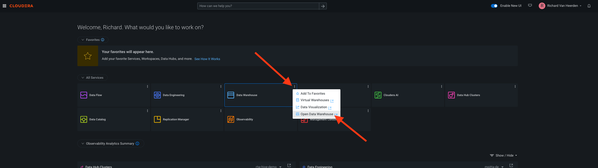

3. Under the **Virtual Warehouses** tab, locate the **workshop-impala-vw**h virtual warehouse and click on the **Hue** application icon.

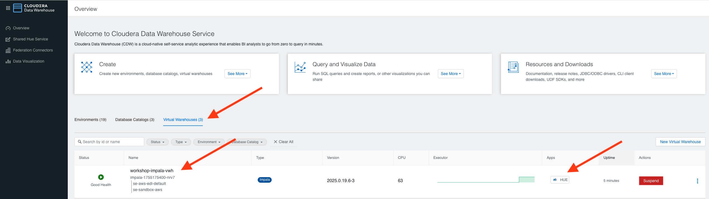

4. In the Hue application that opens in your browser you should see that the Impala engine is selected. Impala is a parallel processing SQL query engine that enables users to execute low latency SQL queries directly against large dataset. Copy and paste the code below into the editor pane. The code uses variables, so enter your user id in the username variable that is displayed at the bottom of the editor pane (e.g. user001).

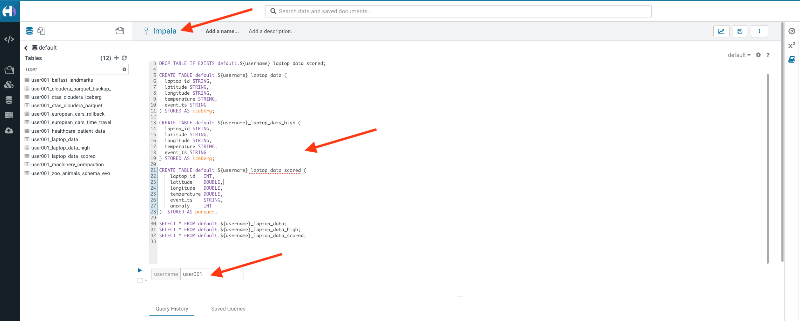

```ruby
DROP TABLE IF EXISTS default.${username}_laptop_data;
DROP TABLE IF EXISTS default.${username}_laptop_data_high;
DROP TABLE IF EXISTS default.${username}_laptop_data_scored;

CREATE TABLE default.${username}_laptop_data (
  laptop_id STRING,
  latitude STRING,
  longitude STRING,
  temperature STRING,
  event_ts STRING
) STORED AS iceberg;

CREATE TABLE default.${username}_laptop_data_high (
  laptop_id STRING,
  latitude STRING,
  longitude STRING,
  temperature STRING,
  event_ts STRING
) STORED AS iceberg;

CREATE TABLE default.${username}_laptop_data_scored (
    laptop_id   INT,
    latitude    DOUBLE,
    longitude   DOUBLE,
    temperature DOUBLE,
    event_ts    STRING,
    anomaly     INT
)  STORED AS parquet;

SELECT * FROM default.${username}_laptop_data;
SELECT * FROM default.${username}_laptop_data_high;
SELECT * FROM default.${username}_laptop_data_scored;
```

5. Use your cursor to select and highlight each SQL statement and execute each one by clicking the execute button :arrow_forward:.
   
   After executing all of the SQL statements you should have created 3 Tables: 2 Iceberg and 1 Parquet and ensured that they are not pre-populated.

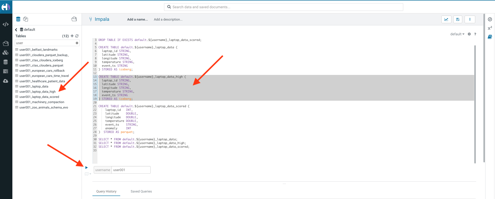

If all is good then we're ready to get on with using Iceberg across the Data Lifecycle!!!

## Lab 1. Streaming Data Ingestion to Iceberg using Cloudera Data Flow

### Overview of the Cloudera Data Flow Service

Cloudera Data Flow is a cloud-native universal data distribution service powered by Apache NiFi​​ that enables you to connect to any data source, process and deliver data to any destination. The cloud-native service enables self-serve deployments of Apache NiFi data flows from a central catalog into auto-scaling Kubernetes clusters, with centralized monitoring and alerting capabilities for the deployments. Let's familiarise ourselves with the Data Flow service.

1. Go back to the Cloudera Control Plane web interface.
2. Click the **Data Flow** tile.

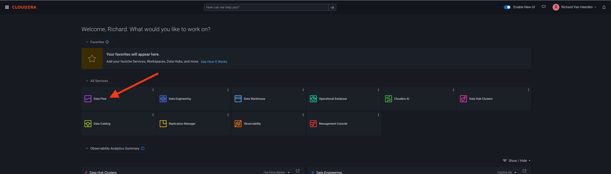

3. The Data Flow landing page will open in your browser which is the Overview menu item from the menu on the left side on the screen. This page provides quick access to Data Flow features and other resources, guides and releaes information.

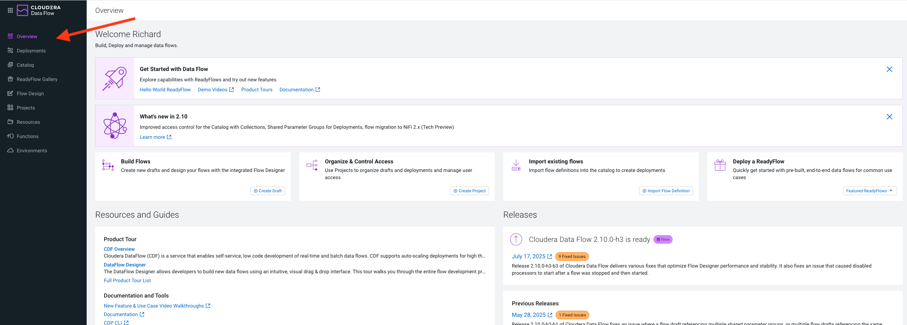

4. In the left hand menu select the next menu item **Deployments**. The Deployments page is the central place for managing and monitoring your Data Flow deployments running on Kubernetes and each executing a specific flow definition.

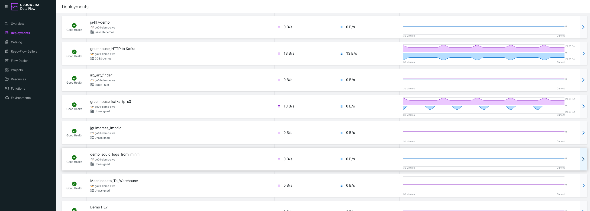

5. In the left hand menu select the next menu item **Catalog**. After building your flows, publish them to the central, version controlled catalog. From the catalog, you or your team members can create new deployments from the published flow definitions.

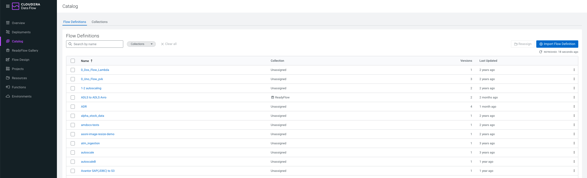   

6. In the left hand menu select the next menu item **ReadyFlow Gallery**. Cloudera Data Flow provides a growing library of ReadyFlows to get you started quickly. ReadyFlows are reference implementations of some of the most common data movement patterns in the industry.

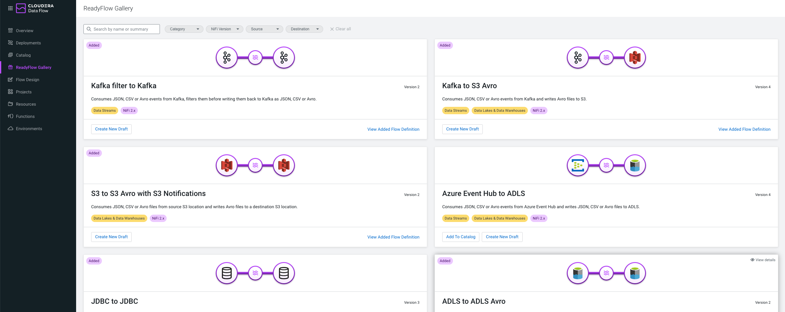

6. In the left hand menu select the next menu item **Flow Design**. Flow Design allows you to create, test, and deploy data pipelines using the Flow Designer. Which is a visual, no-code interface built on Apache NiFi. This interface enables developers to design data flows that move, transform, and route data across various systems. Users can start test sessions to run and validate flows in real-time, making iterative adjustments quickly and easily. 

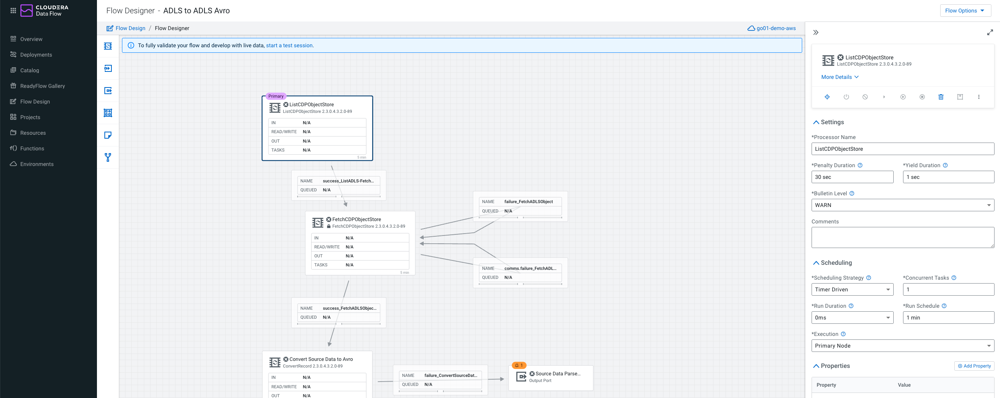

7. In the left hand menu select the next menu item **Projects**. Projects is a workspace management feature that helps you organize and manage your data flow developments.

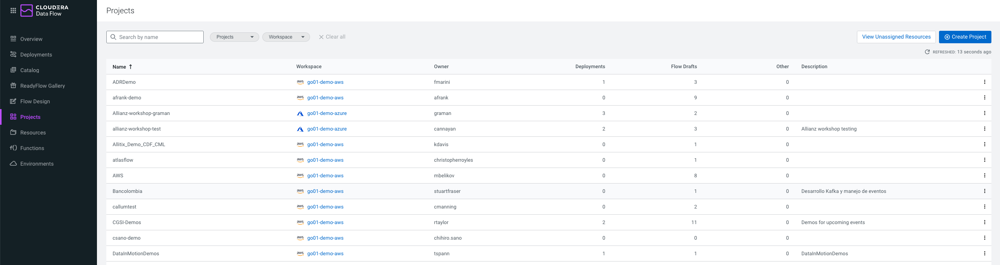

8. In the left hand menu select the next menu item **Resources**. Resources provide a high level overview of your various environments such as projects, deployments, drafts and other information in each.
 
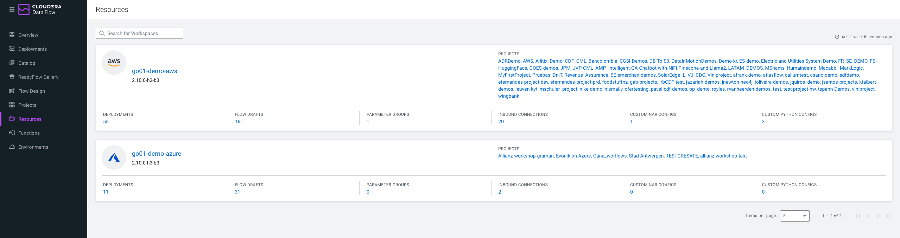

9. In the left hand menu select the next menu item **Functions**. Functions support running your data flows as serverless functions in AWS Lambda, Azure Functions and Google Cloud Functions. While auto-scaling deployments are great for low latency, high throughput data movement use cases, functions are ideal for event-driven or micro-batch related use cases where your flow does not have to be running 24/7.
 
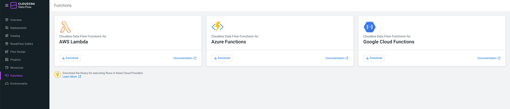

10. In the left hand menu select the next menu item **Environments**. Enviornments list all the automatically discovered enviornments in your Cloudera tenant and where Data Flow can be enabled or disbaled for each environment.

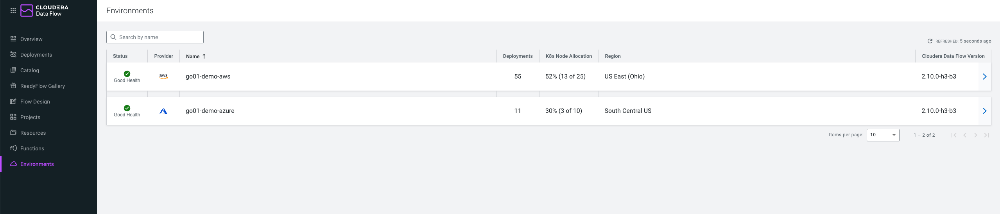

### Deploy a Custom Data Flow Template

Data Flow Templates make it easier to reuse and distribute data flows or specific parts of data flows. Besides reducing development time, reuse also supports the adoption of standards and patterns in data flow design. Data flow templates can help you to build a library of reusable elements that you can use as pre-built components in your new flows.

1. In the left hand menu select the next menu item **Catalog**. In the search field search for **hol-iceberg-populator**.
  
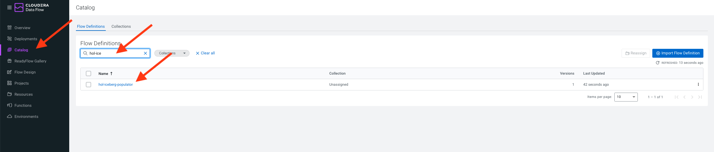

2. Click the flow name **hol-iceberg-populator** and a context window will appear on the right side of the screen. In this context window click the **Actions** dropdown button and select **Create New Draft**.

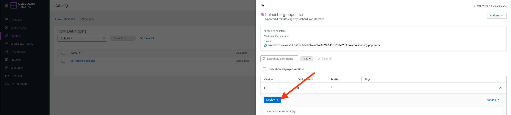

3. In the **Create New Draft** popup screen, select **hol-aws-env** for the **Target Namespace**, **Workshop** for the **Target Project** and **userxxx-hol-iceberg-populator** for the **Draft Name** substituting your assigned user id. Then click the **Create** button. This will display the **Test Session** config page. Accept all the default values and click the **Start Test Session** button.

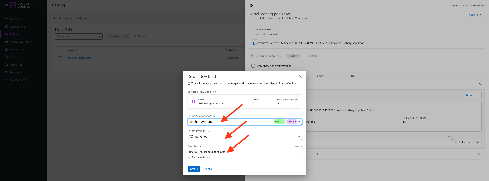

4. A Flow Design canvas will open for you. At the top right of the screen click **Flow Options**, and under that **Test Session** section click the **Start** button. This is going to spin up resource container for us to build our flow.

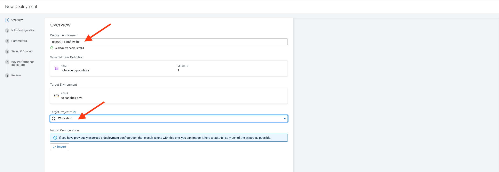

5. While we wait for the Test Session to initialise up, at the top right of the screen click **Flow Options**, and under that click on **Parameters**. 

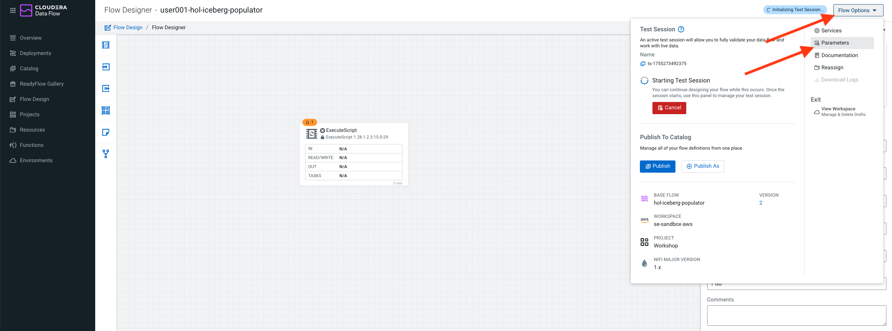

6. On the **Parameters** screen, set the parameters values as indicated below substituting your assigned user id and password. Click the **Apply** button after making the changes and ignore any warnings messages.
 * CDP Workload User: **userxxx**
 * CDP Workload User Password: **userxxx_password**

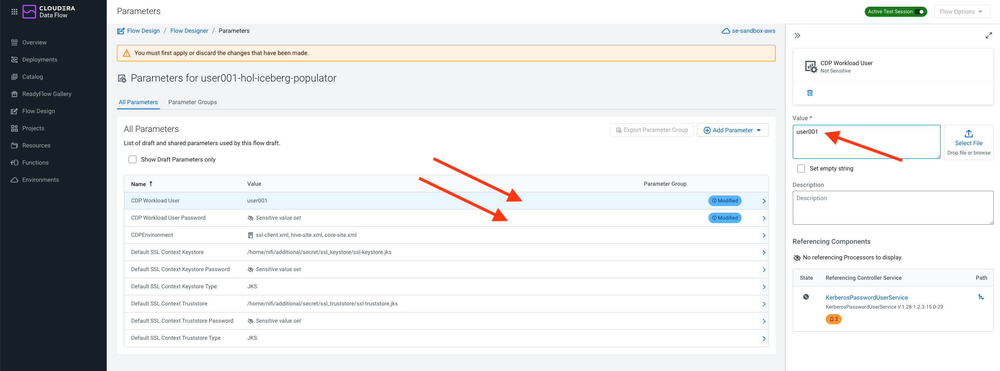

7. At the top right of the screen click **Flow Options** again, and under that click on **Services**.


9. On the Services page, click on each disabled services and click the Enable button for each one. After unebaling they should all have a green check icon next to them :white_check_mark:.

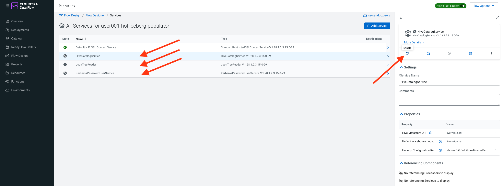

10. Go back to the Flow Designer canvas but clicking **Flow Designer** in the path breadcrumb amd let's start building our flow.


11. On the tool menu on the left drag and drop a **Processor** tool onto your canvas. A popup will appear where you enter **MergeContent** into the search bar. Once it's found the **MergeContent** processor click the **Add** button to add it to your canvas.


