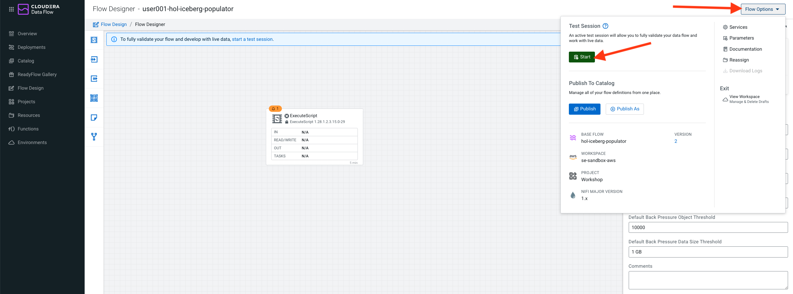
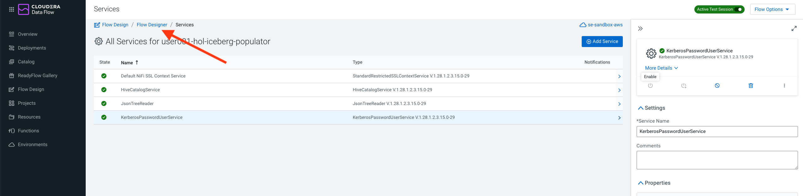
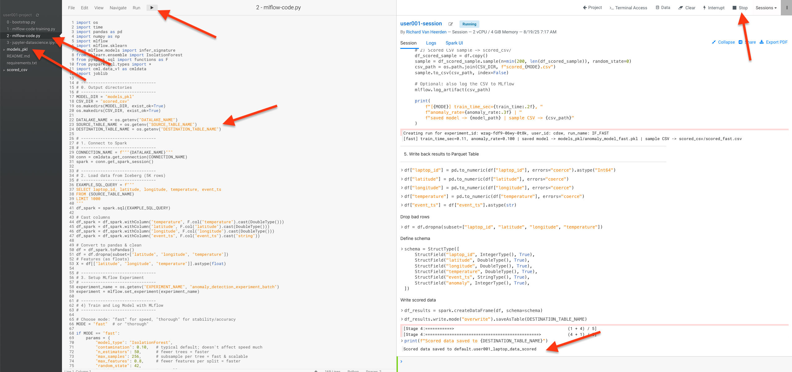
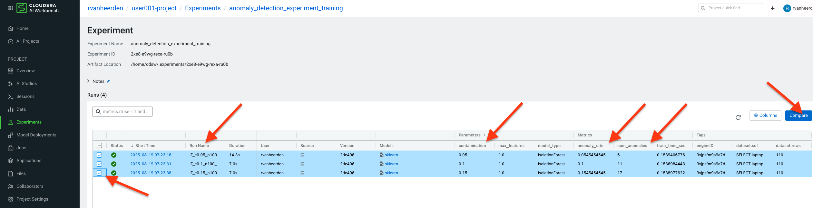
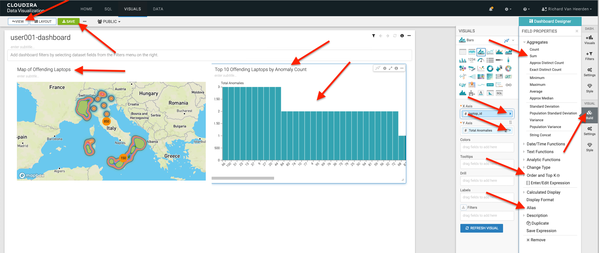

# Section 2: Demonstrating Iceberg Capabilities across the Data Lifecycle and Cloudera Product Stack


Cloudera Open Data Lakehouse powered by Apache Iceberg offers several key benefits that can significantly enhance your data management strategy. First, it provides better **performance and scalability** through innovative metadata management and flexible partitioning. It’s **fully open**, meaning there’s no vendor lock-in—thanks to its open-source foundation, it **supports a diverse ecosystem and community**. The platform also supports **multi-function analytics**, allowing different compute engines to access and process Iceberg tables concurrently and consistently. For those focused on data quality and consistency, it includes advanced capabilities like **ACID-compliant transactions, time travel, rollback, in-place partition evolution, and Iceberg replication**. Finally, Cloudera’s solution stands out with its ability to enable **multi-hybrid cloud deployments**, offering the freedom and portability to deploy wherever you need.

This hands-on lab takes you through the data lifecycle showcasing the ability to work with the same Iceberg tables across multiple engine and analytics types.

## Before Starting the Labs

Your workload user name and password has been provided by the facilitator e.g. user001/hsgdguquuqyququ. Keep it handy as you'll need it for certain configurations.

We're going to create some Iveberg tables to use across the labs in this section.

1. Sign in to the Cloudera Control Plane web interface.
2. On the **Data Warehouse** tile, click on the ellipses &#10247;and select **Open Data Warehouse**.


3. Under the **Virtual Warehouses** tab, locate the **workshop-impala-vw**h virtual warehouse and click on the **Hue** application icon.


4. In the Hue application that opens in your browser you should see that the Impala engine is selected. Impala is a parallel processing SQL query engine that enables users to execute low latency SQL queries directly against large dataset. Copy and paste the code below into the editor pane. The code uses variables, so enter your user id in the username variable that is displayed at the bottom of the editor pane (e.g. user001).


```ruby
DROP TABLE IF EXISTS default.${username}_laptop_data;
DROP TABLE IF EXISTS default.${username}_laptop_data_high;
DROP TABLE IF EXISTS default.${username}_laptop_data_scored;

CREATE TABLE default.${username}_laptop_data (
  laptop_id STRING,
  latitude STRING,
  longitude STRING,
  temperature STRING,
  event_ts STRING
) STORED AS iceberg;

CREATE TABLE default.${username}_laptop_data_high (
  laptop_id STRING,
  latitude STRING,
  longitude STRING,
  temperature STRING,
  event_ts STRING
) STORED AS iceberg;

CREATE TABLE default.${username}_laptop_data_scored (
    laptop_id   INT,
    latitude    DOUBLE,
    longitude   DOUBLE,
    temperature DOUBLE,
    event_ts    STRING,
    anomaly     INT
)  STORED AS parquet;

SELECT * FROM default.${username}_laptop_data;
SELECT * FROM default.${username}_laptop_data_high;
SELECT * FROM default.${username}_laptop_data_scored;
```

5. Use your cursor to select and highlight each SQL statement and execute each one by clicking the execute button :arrow_forward:.
   
   After executing all of the SQL statements you should have created 3 Tables: 2 Iceberg and 1 Parquet and ensured that they are not pre-populated.


If all is good then we're ready to get on with using Iceberg across the Data Lifecycle!!!

## Lab 1. Streaming Data Ingestion to Iceberg using Cloudera Data Flow

### Overview of the Cloudera Data Flow Service

Cloudera Data Flow is a cloud-native universal data distribution service powered by Apache NiFi​​ that enables you to connect to any data source, process and deliver data to any destination. The cloud-native service enables self-serve deployments of Apache NiFi data flows from a central catalog into auto-scaling Kubernetes clusters, with centralized monitoring and alerting capabilities for the deployments. Let's familiarise ourselves with the Data Flow service.

1. Go back to the Cloudera Control Plane web interface.
2. Click the **Data Flow** tile.


3. The Data Flow landing page will open in your browser which is the Overview menu item from the menu on the left side on the screen. This page provides quick access to Data Flow features and other resources, guides and releaes information.


4. In the left hand menu select the next menu item **Deployments**. The Deployments page is the central place for managing and monitoring your Data Flow deployments running on Kubernetes and each executing a specific flow definition.


5. In the left hand menu select the next menu item **Catalog**. After building your flows, publish them to the central, version controlled catalog. From the catalog, you or your team members can create new deployments from the published flow definitions.

   

6. In the left hand menu select the next menu item **ReadyFlow Gallery**. Cloudera Data Flow provides a growing library of ReadyFlows to get you started quickly. ReadyFlows are reference implementations of some of the most common data movement patterns in the industry.


6. In the left hand menu select the next menu item **Flow Design**. Flow Design allows you to create, test, and deploy data pipelines using the Flow Designer. Which is a visual, no-code interface built on Apache NiFi. This interface enables developers to design data flows that move, transform, and route data across various systems. Users can start test sessions to run and validate flows in real-time, making iterative adjustments quickly and easily. 


7. In the left hand menu select the next menu item **Projects**. Projects is a workspace management feature that helps you organize and manage your data flow developments.


8. In the left hand menu select the next menu item **Resources**. Resources provide a high level overview of your various environments such as projects, deployments, drafts and other information in each.
 


9. In the left hand menu select the next menu item **Functions**. Functions support running your data flows as serverless functions in AWS Lambda, Azure Functions and Google Cloud Functions. While auto-scaling deployments are great for low latency, high throughput data movement use cases, functions are ideal for event-driven or micro-batch related use cases where your flow does not have to be running 24/7.
 


10. In the left hand menu select the next menu item **Environments**. Enviornments list all the automatically discovered enviornments in your Cloudera tenant and where Data Flow can be enabled or disbaled for each environment.


### Deploy a Custom Data Flow Template

Data Flow Templates make it easier to reuse and distribute data flows or specific parts of data flows. Besides reducing development time, reuse also supports the adoption of standards and patterns in data flow design. Data flow templates can help you to build a library of reusable elements that you can use as pre-built components in your new flows.

1. In the left hand menu select the next menu item **Catalog**. In the search field search for **hol-iceberg-populator**.
  


2. Click the flow name **hol-iceberg-populator** and a context window will appear on the right side of the screen. In this context window click the **Actions** dropdown button and select **Create New Draft**.


3. In the **Create New Draft** popup screen, select **hol-aws-env** for the **Target Namespace**, **Workshop** for the **Target Project** and **userxxx-hol-iceberg-populator** for the **Draft Name** substituting your assigned user id. Then click the **Create** button. This will display the **Test Session** config page. Accept all the default values and click the **Start Test Session** button.


4. A Flow Design canvas will open for you. At the top right of the screen click **Flow Options**, and under that **Test Session** section click the **Start** button. This is going to spin up resource container for us to build our flow.



5. After the Test Session has initialised, at the top right of the screen click **Flow Options**, and under that click on **Parameters**. 


6. On the **Parameters** screen, set the parameters values as indicated below substituting your assigned user id and password. Click the **Apply** button after making the changes and ignore any warnings messages.
 * CDP Workload User: **userxxx**
 * CDP Workload User Password: **userxxx_password**


7. At the top right of the screen click **Flow Options** again, and under that click on **Services**.


9. On the Services page, click on each disabled services and click the Enable button for each one. After unebaling they should all have a green check icon next to them :white_check_mark:.


10. Go back to the Flow Designer canvas but clicking **Flow Designer** in the path breadcrumb amd let's start building our flow. You'll se an existing ExecuteContent processor on the canvas already. This is one we're already create for you to reuse that generates synthetic data. Typically this data would be coming from a source like Kafka, database system or IOT device. 



11. On the tool menu on the left drag and drop a **Processor** tool onto your canvas. A popup will appear where you enter **MergeContent** into the search bar. Once it's found the **MergeContent** processor click the **Add** button to add it to your canvas.


12. **Repeat** the same process to add a **PutIceberg** processor to your canvas.
    
13. Drag and drop the two new processors to align them neatly on your canvas in the order **ExecuteContent -> MergeContent -> PutIceberg**. Now move your cursor to the bottom right of each processor, clicking the arrow area and dargging and dropping the arrow to the processor you want to connect it to as shown below. For the **ExecuteContent -> MergeContent** connection select the condition of **Success** for the link and for the  **MergeContent -> PutIceberg** connection select the condition of **Merged** for the link.


14. On the canvas select the **MergeContent** processor. In the conext window on the right set the following **Properties** and **Relationships** values for the processor:
     * Properties:
       * Minimum Number of Entries: 10
     * Relationships:
       * failure: Terminate
       * original: Terminate
    Click the **Apply** button at yhe bottom of the Processor context window. 


15. On the canvas select the **PutIceberg** processor. In the conext window on the right set the following **Properties** and **Relationships** values for the processor:
     * Properties:
       * Record Reader: JsonTreeReader (select from dropdown)
       * Catalog Service: HiveCatalogService (select from dropdown)
       * Catalog Namespace: Select the ellipses &#10247;and select **Convert to Parameter**. In the **Add Parameter** popup, enter **default** into the **Value** field and click **Apply** button.
       * Table Name: Select the ellipses &#10247;and select **Convert to Parameter**. In the **Add Parameter** popup, enter **userxxx_laptop_data** into the **Value** field substituting your assigned user id and click **Apply** button.
       * Kerberos User Service: KerberosPasswordUserService (select from dropdown)
     * Relationships:
       * failure: Terminate
       * original: Terminate
  Click the **Apply** button at yhe bottom of the Processor context window. 


16. On the canvas right click the **ExecuteScript** processor and select the **Start** option.


17. You should notice the **ExecuteScript** processor changes icon status to green meaning it's running and you should see flowfiles accumulating in the **Success** relationhip. Right click on the **Success** relationship block and select the **List Queue** option.


18. We can inspect the flowfiles that have been generated in the Queue by selecting any of the folowfile records and clicking on the **Open Data in Viewer** icon. Take a look at the data that is being generated across the different flowfiles.


19. On the canvas right click the **MergeContent** processor and select the **Start** option. Right click on the **mergecontent** relationship block and select the **List Queue** option. As in the step before look at the data in the flowfile and notice how it's merged the the original flowfiles into a larger flowflow based on the settings configured in the **MergeContent** processor.


20.  On the canvas right click the **PutIceberg** processor and select the **Run Once** option. This is a reallyt interesting feauture about Nifi where you can develop on the fly and control flowfiles between Processors individually while building and testing your flow without having to recomplie anything.


21. If no warnings appear on the **PutIceberg** processor we can go to Hue SQL IDE and check we are getting data into our Iceberg table. See if you can remember how to to do this
> [!TIP] 
> **Data Warehouse** tile -> **Open Data Warehouse** -> **Virtual Warehouses** -> **workshop-impala-vw** -> **Hue**

```ruby
select * from default.${username}_laptop_data;
```


22. Finally go back to your **Flow Designer** canvas and right click the **PutIceberg** processor and select the **Start** option. Our flow is running fully now and will continue to stream data into our Iceberg table. Typically we would productionise our flow by publishing it back to the **Catalog** and creating a **Deployment** it onto an autoscaling Kubernetes containers where it can be centrally monitored. But for the purposes of this hands-on lab we can leave it running in the Test Session.


## Lab 2. Machine Learning with Iceberg tables using Cloudera AI

Another approach to evaluate and review your data is by using Cloudera AI. In this exercise, we will analyze the simple Iceberg dataset we created above by developing and training an anomaly detection model to identify unusually high and low laptop temperatures.
Additionally, we will use JupyterLab within Cloudera AI to interact with and integrate the model’s output, enabling further exploration and analysis.

### Creating and Setting up your Cloudera AI Project

1. From the CDP Control plane, click the **Cloudera AI** tile.


2. In the **Cloudera AI** application select the **nemea-workshop-v1** workbench to open it.


3. This will open the Cloudera AI workbench Landing Page. Click the **Create a new project** tile on the top left of the landing page.


4. In the **New Project** dialog, supply a Project Name in the format of **userxxx-project**, substituting you supplied user id. For **Initial Setup** select the **Git** option and use the following **HTTPS** path **https://github.com/richard-vh/iceberg-spark-hol-cai.git**. Click the **Create Project** button.


5. In your new project, click on **Project Settings** in the left menu.


6. Under the **Project Settings**, **Advanced** tab, add the following **Enviornment Variables**, substituting your supplied user id (click the + button to add). Once you're done click the **Sumbit** button.
   * SOURCE_TABLE_NAME: **default.userxxx_laptop_data**
   * DESTINATION_TABLE_NAME: **default.userxxx_laptop_data_scored**
   * DATALAKE_NAME: **nemea-hol-v2-aw-dl**


### Running Interactive Spark Session and Training and Tuning Models

7. Click **Sessions** in the left menu and click the **New Session** button.


8. In the **Start A New Session** dialog use the following values, substituting your supplied user id. Once you're done click the **Start Session** button.
   * Session Name: **userxxx-session**
   * Runtime 
     * Editor: **PBJ Workbench**
     * Kernel: **Python 3.10**
     * Edition: **Standard**
   * **Enable Spark** toggle
   * Resource Profile: **2 vCPU/4 GiB Memory**   


9. After the session container initialises, click the **Close** button on the **Connection Code Snippet** dialog if it appears.


10. In the left menu, click on **0 - bootstrap.py** to open the file in the editor. This file is used to load the required Python packages for this lab. Review the **requirements.txt** file on the left menu to understand what packages will be downloaded and installed. Click on **0 - bootstrap.py** again to open the file in the editor. Run the file by clicking the Run &#9658;button. Review the messges in the **Session** output pane on the right - once the packages have successfully installed you'll see the message **PYTHON PACKAGES ARE INSTALLED**.


11. In the left menu, click on **1 - mlflow-code-training.py** to open the file in the editor. Review the script - it connects to a Spark data source, retrieves sensor-like data (latitude, longitude, temperature) from our ceberg table (**SOURCE_TABLE_NAME** variable), and converts it into a Pandas DataFrame for anomaly detection.It uses a parameter grid to train multiple Isolation Forest models with different hyperparameters, logging each run’s parameters, metrics (e.g., anomaly rate), and artifacts (trained model files and scored sample CSVs) to MLflow.The process includes automatic directory creation, experiment setup, model training, anomaly scoring, metric calculation, and artifact storage, enabling reproducible experimentation and result tracking. Run the file by clicking the play &#9658; button.

    In the **Session** output messages in the right pane after the file has run you'll see the message **All runs complete**. If you examine the Session output messages you'll notice the ML model has been run 3 experiments with different parameters under the MLFlow experiment name **anomaly_detection_experiment_training** (Can you spot this setup in the script?). We'll review this in the CAI **Experiments** section later in the section **Reviewing Prior Model Runs**. 


12. In the left menu, click on **2 - mlflow-code.py** to open the file in the editor. Review the script - it connects to Spark, loads a sample of sensor-like data (latitude, longitude, temperature) from our Iceberg table (**SOURCE_TABLE_NAME** variable), and prepares features for anomaly detection. It trains an Isolation Forest model using input hyperparameters fast vs. thorough modes, logs the parameters,metrics and artifacts to MLflow, and saves a local model pickle file plus a scored CSV sample. Finally, it writes the fully scored dataset, including the anomaly flag, back to the data lake as a Parquet-backed table (**DESTINATION_TABLE_NAME** variable) for downstream analytics.. Run the file by clicking the play &#9658; button.

    In the **Session** output messages in the right pane after the file has run you'll see the message **Scored data saved to default.userxxx_laptop_data_scored**. You'll also notice in the file menu on the left a new model pickle file is created called **models_pkl**. Finally stop your session as we've finsihed with it for now by clicking on the stop &#9632; button at the top right of the screen.



### Using JupyterLab to review the model output

1. To use JupyterLab in CAI we need to create a Session that uses a JupyterLab editor. See if you can figure out how to start a new session (ask you instructor if you get stuck). In the **Start A New Session** dialog use the following values, substituting your supplied user id. Once you're done click the **Start Session** button.
   * Session Name: **userxxx-jupyter-session**
   * Runtime 
     * Editor: **JupyterLab**
     * Kernel: **Python 3.10**
     * Edition: **Standard**
   * **Enable Spark** toggle
   * Resource Profile: **2 vCPU/4 GiB Memory**
  


2. After the pod initialises the JupyterLab landing page will appear.


3. In the left menu, doubleclick on **3 - jupyter-datascience.ipynb** to open the notebook. Run each code cell in the notebook by clicking on the code cell and clicking the run &#9658; button. As the cell code run you will see an [&#10033;] next to the cell while it's running. Review the comments, code and output in each cell as you run them. Finally stop your session as we've finsihed with it for now by clicking on the stop &#9632; button at the top right of the screen.


### Reviewing Model Run Experiments

In the Traing & Tuning section we completed earlier we created and MLFlow experiment where we ran the model three times provide different hyperparameter values to influence how the model learnt from the data. Let's take a closer look at the experiments we ran.

1. On the left menu click **Experiments**. On the **Experiments** page you should see a **training** and **batch** experiment that we ran earlier. Click in the **training** experiment.


2. In the experiment you should see three lines. When we ran the file **1 - mlflow-code-training.py** it ran the model training three times each with different parameters for each one. The experiment allows us to easily compare each run and track model metrics to determine which parameters provided the best model training. By selecting the check box next to each of the runs we can comapre the run metrics in a tabular format. Select the checkboxes and click the **Compare** button.



3. In the Experiment run comparison screen look at the comparisons as well as plotting features available. Its worth noting that our data evaluated is incredibly small per design and the model process was not overly complicated so you may not see any significant differences. 


### Scheduling a Job in Cloudera AI

Previously we ran two model training sets, training and batch. We are going to create a scheduled job to run this on a daily basis at 1am. This can be useful when you have developed a Python script which you want to run on a periodic basis or your training data changes frequently. 

1. On the left menu click **Jobs**. Click the **New Job** button on the top right.


2. In the **Create Job** dialog, set the following values, substituting your supplied user id. Once ypu're done click the **Create Job** button at the bottom of the screen.
   * Name: **userxxx-job**
   * Script: **2 - mlflow-code.py**
   * Runtime 
     * Editor: **PBJ Workbench **
     * Kernel: **Python 3.10**
     * Edition: **Standard** 
   * Toggle **Enable Spark** (Ensure Spark 3 is selected)
   * Schedule: **Recurring and Day, 1, 0**
   * Resource Profile: **2vCPU / 4 GiB Memory**


2. As we don't want to wait for 1am for the job to run, let's run it now. Click the **Run as** button on the **Jobs** page job line. You should see a message on the top right of the screen that the job has started successfully,


3. To view the job details, run history, logs and settings click on the Job Name. Click through each of the tabs and familiarise yourself with the job information available. There are four tabs:
   * **Overview**: Job details and run history
   * **History**: Deatiled job run history and access to logs for each job run.
   * **Dependencies**: Any other job dependencies that may be chained to this job.
   * **Settings**: The job settings where settings can be viewed and changed.
  


### Delete CAI Project and Clean up resources

Now that we've cpmpleted the Machine Learning segment of this hands-on lab, we can delete the CAI project we created.

1. On the left menu click **Project Settings** and click on the **Delete Project** tab. Click the **Delete Project** button.


## Lab 3. Data Visualization using Iceberg tables in Cloudera Data Warehouse

In the previous exercises, we ingested synthetic laptop temperature data into Iceberg tables and used Cloudera AI to identify laptops showing abnormal temperature patterns.
Next, we’ll use Cloudera DataViz to build interactive dashboards that support downstream reporting and real-time monitoring.

1. Navigate to the Cloudera Data Warehouse home page. Another quick way of doing this is by clicking the **App Selector** &#x1392;&#x1392;&#x1392; image at the top left of the screen and selecting **Data Warehouse**.


2. On the left menu click **Data Visualization**. Click the **Data Viz** button on the right of the instance that's been setup for the lab.


3. On the Data Viz landing page, click the **Data** tab on the top menu.
   


5. On the **Data** page, make sure the Impala-Connection is selected and click the **New Dataset** button.


6. In the **Create New Dataset** dialog, enter the following values substituting your assigned user id. When you're done, click the **Create** button.
   * Dataset Title: **userxxx-data**
   * Dataset Source = **From Table**
   * Select Database = **default**
   * Select Table = **userxxx_laptop_data_scored**


7. Click the **New Dashboard** icon shortcut next to your newly created dataset.


8. A new dashboard based on your dataset is created with a default table visual of the data. Move your dashboard to the **Public** workspace and click the **Move** button. Then give your dashboard a name **userxxx-dashboard** substituting you assigned user id.


9. Lets change the default visual in our dashboard to an **Interactive Map**. Highlight the existing visual on the dashboard by clicking on it, then click the **Build** button on the right hand menu. Under the **Visuals** section, select the **Interactive Map** visual icon.


9. In the Visual's attributes section, from the field shelves drag **latitude** and **longitude** into the Visuals **Dimensions** attribute field and drag **anomaly** into the Visuals **Measures** attribute field. Finally click the **Refresh Visual** button. You will see the default Table visual on the dashboard change to an Interactive Map visual.

 

10. Let's add a new visual to the dashboard. At the top of the right menu click on the **+ Visuals** button. This will add a new visual to the dashboard based on your existing dataset (You can select different datasets but for the porposes of the lab we'll use the same one).


14. Highlight the new visual on the dashbaord and in the **Visuals** section, select the **Bar** visual icon. In the Visual's attributes section, from the field shelves drag **laptop_id** into the Visuals **X Axis** attribute field and drag **anomaly** into the Visuals **Y Axis** attribute field.
    


12. In the Visual's attributes section, click the play &#9658; button next to the X Axis **sum(laptop_id)** field. This will open the **Field Properties** context dialog. The the field property Aggregates section, uncheck the **Sum** aggregate. Click the play &#9658; button next to the Y Axis **sum(anomaly)** field and in the field propoerties **Order and Top k** section, check the **Descending** option. Finally click the **Refresh Visual** button - you will see the new visual on the dashboard change to an **Bar Chart** visual. 


